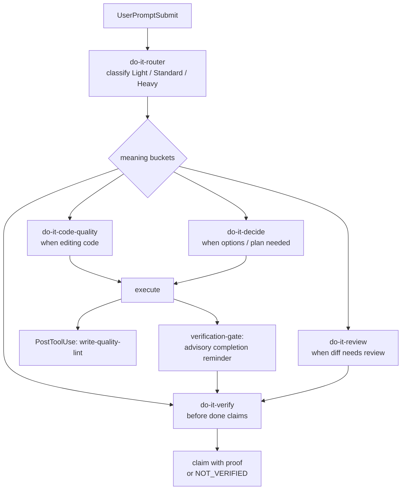

# do-it

[English](./README.md) | [中文](./README.zh-CN.md)

[](https://github.com/tdwhere123/do-it/actions/workflows/ci.yml)
[](https://github.com/tdwhere123/do-it/actions/workflows/codeql.yml)
[](LICENSE)

> Stop asking AI agents to remember process. Install it.

`do-it` turns AI coding discipline into an installable workflow for **Codex**,
**Claude Code**, **Cursor**, and **OpenCode**. It gives work an advisory risk
label, offers optional sub-agent expertise, and keeps completion claims tied to
fresh, claim-specific evidence.

This is the workflow I use every day for real project work. If it fits your
style, use it. If something feels wrong, open an issue, send a PR, or fork it
and reshape it for your own agent setup.

## The Four Moves

### Route the work

Every prompt gets an advisory `Light`, `Standard`, or `Heavy` label. The router
then suggests which **meaning buckets** may help — not a fixed pipeline. Direct
user intent and the model's reading of the task take precedence over keyword
classification.

- `Light`: small local edits, docs tweaks, one-off checks.
- `Standard`: normal non-trivial engineering work — load buckets only when the
  task needs them.
- `Heavy`: releases, architecture changes, cross-module policy, public
  workflow changes, or irreversible closeout — pressure-test a premise or load
  a decision capability when it would change the route.

| Bucket | Skill | When |
|---|---|---|
| Write defense | `do-it-code-quality` | Editing code — scope, TDD, debugging, contracts |
| Decide | `do-it-decide` | Options unclear, load-bearing premises, durable plan |
| Review | `do-it-review` | Delivered diff needs scrutiny and repair |
| Verify | `do-it-verify` | Before done / ready / merge claims |

The point is not more ceremony. Small work stays small; Standard work does not
carry a mandatory brainstorm → grill → plan → review chain; Heavy earns extra
scrutiny only when the risk is real. Independent sub-agent work can help at any
tier when the task calls for it.

### Delegate freely

Bundled sub-agents are optional capability experts, not a pipeline. Use one
when an independent map, review, or specialist view improves the work—especially
after a direct user request. Give a worker the goal, any necessary ownership or
side-effect boundary, and the useful result or evidence; add context only when
the slice needs it.

Workers can inspect autonomously, return uncertainty, and leave integration and
final claims to the parent. There is no required delegation contract, agent
count, or role matrix. User-defined global agents stay outside do-it's
plugin-owned inventory and are not overwritten by plugin updates.

### Prove the result

`do-it` treats "done" as an evidence claim. `do-it-verify` asks for fresh,
claim-specific proof from the current worktree; if proof is unavailable, say
`NOT_VERIFIED` and name the next check.

The `verification-gate` hook is only an advisory reminder. It does not whitelist
commands or block ordinary local work. That keeps closeout tied to the
repository's actual state, not the agent's confidence.

For external side effects, do-it asks the agent to confirm first; only the
host's sandbox, approval policy, and command rules can enforce that boundary.
Treat a plugin hook reminder as advisory, never as a substitute for host-native
permissions. Claude alone also has an optional, default-off named-command
profile that returns a real host `ask` decision; it is not a universal veto.
See [strict external actions](./docs/strict-external-actions.md).

### Learn from behavior without adding default noise

The feedback recorder is off by default. Use
`/do-it-retrospective on` to start redacted, project-local capture and
`/do-it-retrospective report` for a compact report (valid/skipped events,
repeated signals, at most three candidate lessons, and remaining uncertainty).
It never injects prompt context, conservatively ignores ordinary work prompts,
and never writes
`AGENTS.md` or `CLAUDE.md` without an exact later confirmation.
In a Git checkout, its runtime directory is hidden through the worktree-local
Git exclude; it does not edit the project's `.gitignore`.

### Keep it small

`do-it` treats every line as a liability before it is an asset. A shared
**decision ladder** runs across the whole write lifecycle: does this need to
exist at all? → can stdlib do it? → a platform native? → an installed
dependency? → one line? → only then a minimal custom build. The first rung that
works wins.

It is wired into three points, not bolted on as a linter:

- **Before** you write, use `do-it-decide` when a load-bearing premise needs a
  necessity question.
- **While** you write, `do-it-code-quality` plus the advisory
  `write-quality-lint` hook flag comment discipline, coarse anti-patterns, and
  integrity smells on newly-added lines (one reminder per file; never blocks).
- **After** you write, `do-it-review` tags what can be deleted, inlined, or
  replaced by stdlib, then fixes Blocking/Important findings.

Safety is never what gets cut: trust-boundary validation, data-loss handling,
security, and accessibility stay in.

## Install (plugin-first)

Delivery is host-specific. Codex and Claude Code are **marketplace-first**;
Cursor is **local copy or Team Import today, with public listing pending**; and
OpenCode is **local `opencode.json` registration today, with npm publication
pending**. Plugin bundles ship skills, agents, and hooks together.

| Truth plane | What this repository can claim |
|---|---|
| Source/package metadata | This checkout declares `0.14.0`, 9 user/runnable skills + 1 generated discovery entry, and 10 agents. |
| Git tag | This checkout has no matching `v0.14.0` tag; version metadata is not a release tag. |
| Marketplace / npm | Coordinates and future publish paths are documented, but metadata alone does not prove a public listing or registry publication. |
| Live host | Only an install/inspection on that host proves what is active there; do not infer it from source or a packed artifact. |

### Codex

```bash
codex plugin marketplace add tdwhere123/do-it
codex plugin add do-it@tdwhere-do-it
```

`codex plugin marketplace add` only registers the marketplace — it does not
install the plugin. After install, **trust the plugin hooks** under `/hooks` so
the default-off feedback recorder, routing, Heavy grill nudge, subagent stance,
write-quality lint, and the verification reminder are available.

Local checkout smoke test (use a temp `CODEX_HOME` if needed):

```bash
CODEX_HOME=/tmp/do-it-plugin-test codex plugin marketplace add /path/to/do-it
CODEX_HOME=/tmp/do-it-plugin-test codex plugin add do-it@tdwhere-do-it
```

The Codex plugin bundle lives at `plugins/do-it/` (generated from
`manifest.json`): 9 user/runnable skills, 1 generated `_index.md` discovery
entry, and 10 agents, plus plugin-local hooks.

Modern Codex plugins own those bundled do-it agents.
`manifest.targets.codex.installAgents=false` keeps `~/.codex/agents` for
user-defined agents; legacy migration removes only confirmed old do-it
duplicates.

### Claude Code

```text
/plugin marketplace add tdwhere123/do-it
/plugin install do-it@do-it
```

### Cursor

**Cursor does not use Claude Code `/plugin …` slash commands.**

Cursor has an official marketplace
([cursor.com/marketplace](https://cursor.com/marketplace)), but **`do-it` is not
listed there yet**. Until it is submitted/reviewed, use:

1. **Local (recommended today):**
   ```bash
   npm run build:cursor-plugin
   node scripts/install-cursor-local.mjs
   ```
   then **Developer: Reload Window**. This copies into
   `~/.cursor/plugins/local/do-it-cursor` as a **real directory** (Cursor
   rejects external symlinks) and merges do-it hooks into user-level
   `~/.cursor/hooks.json` via `hooks/run-hook.cmd …` (plugin-local hooks are
   not registered by current Cursor Hooks UI/service; bare `.sh` commands on
   Windows open in the editor instead of executing). On **native Windows**
   the target is `%USERPROFILE%\.cursor\plugins\local\do-it-cursor` (never
   `/mnt/c/...`). On Windows+WSL the script also mirrors into that Windows
   profile when it can see `/mnt/c/Users`. After reload, verify the exact
   plugin directory exists and Customize → Hooks lists user-level do-it `.cmd`
   entries; Agent turns must not pop `.sh` source. This local-copy path does not
   create managed CLI install state, so ordinary `do-it doctor` is not its
   verifier.
2. **Managed CLI setup:** `do-it setup --target=cursor` then reload (same
   `…/plugins/local/do-it-cursor` path + user hooks merge). `setup` runs managed
   install plus `doctor`; later `do-it doctor --target=cursor` applies only to
   this managed CLI setup.
3. **Team Import (no public listing needed):** Dashboard → Plugins → Import
   from Repo → `https://github.com/tdwhere123/do-it` (reads
   `.cursor-plugin/marketplace.json`).
4. **Public listing later:** submit at
   [cursor.com/marketplace/publish](https://cursor.com/marketplace/publish).

Cursor gets the **full 9 skills** (`do-it-router`, `do-it-code-quality`,
`do-it-review`, `do-it-decide`, `do-it-verify`, plus `do-it-handbook`,
`do-it-context`, `do-it-skill-authoring`, and `do-it-retrospective`) with skills index and `references/`
— the same set as Codex, Claude, and OpenCode.

Medium hook depth: `sessionStart`, `beforeSubmitPrompt` (router / Heavy grill /
stance), `postToolUse` / `afterFileEdit` advisory `write-quality-lint`, and
`stop` verification gate. See
[`docs/harness-adapter-matrix.md`](./docs/harness-adapter-matrix.md).

### OpenCode

OpenCode loads plugins from the `"plugin"` array in `opencode.json`. **Local
path is primary today:**

```bash
npm run build:opencode-plugin
cd plugins/do-it-opencode && npm install   # once, if dependencies are missing
```

Register the built plugin directory with an absolute path in project or global
`opencode.json` (see
[`plugins/do-it-opencode/docs/README.opencode.md`](./plugins/do-it-opencode/docs/README.opencode.md)).

When `@tdwhere/do-it-opencode` is published to npm, OpenCode can auto-install it
from the `"plugin"` array at startup — use the local path until then.

```bash
npm run test-opencode
```

### Optional / legacy: `do-it setup`

CLI setup remains for doctor checks, temp-home smoke tests, and migration from
older global installs. It is **not** the recommended first install. Prefer the
plugin marketplace; use setup only to mirror or migrate — do not run plugin
install and a live, do-it-managed legacy mirror at the same time. User-defined
global agents can remain separate.

```bash
npm install -g https://github.com/tdwhere123/do-it/archive/refs/heads/main.tar.gz
do-it setup                  # Codex legacy global copy
do-it setup --target=claude  # optional CLI mirror of the Claude plugin
do-it setup --target=cursor  # optional CLI mirror of the Cursor plugin
do-it doctor
```

`DO_IT_FORCE=1` only when you intentionally replace unmarked skill/agent
targets. Prefer a temporary home (`CODEX_HOME=…`, `CLAUDE_PLUGIN_ROOT_OVERRIDE=…`,
`CURSOR_PLUGIN_ROOT_OVERRIDE=…`) when testing.

## What It Installs

Runnable skill matrix (tiers in `scripts/skill-tiers.mjs`):

| Host | User/runnable skills | Discovery metadata | Agents |
|---|---|---|---|
| Codex / Claude / Cursor / OpenCode | 9 — 5 core + 4 extended | 1 generated `_index.md` entry (not a tenth skill) | 10 |

- Meaning-bucket skills: `do-it-router`, `do-it-code-quality` (write defense),
  `do-it-review` (review + fix), `do-it-decide` (pressure-test / diverge /
  plan / slice), `do-it-verify` (evidence + closeout), plus extended
  `do-it-handbook`, `do-it-context`, `do-it-skill-authoring`, and
  on-demand `do-it-retrospective`.
- Ten portable agents: decide lenses (`product-strategist`,
  `architecture-strategist`, `plan-challenger`), write lenses (`code-mapper`,
  `code-quality-cleaner`, `tdd-red-writer`), review lenses (`reviewer`,
  `red-team-reviewer`, `spec-compliance-reviewer`), and
  `documentation-engineer`.
- Plugin-bundled hooks on all four hosts: default-off, silent
  `behavior-feedback`; router; Heavy-only `grill-prompt`;
  `subagent-stance`, advisory `write-quality-lint`, and `verification-gate`.
  The verification hook is an advisory reminder on every host; `do-it-verify`
  remains responsible for claim-specific proof. No host registers a
  `grill-pretool` plan gate.
- Claude slash commands under `commands/` (`do-it-skip`, `do-it-handbook`,
  `do-it-retrospective`); no legacy workflow command aliases.
- Copy-based installer / `doctor` for optional CLI targets and migration.
- Root `index.json` for external discovery and coverage checks.

For exact-path, host-specific removal that preserves unrelated plugins and hook
entries, use the [safe cleanup runbook](./docs/maintenance.md#safe-cleanup-runbook).
Never recursively delete a host configuration root to remove do-it.

## The Flow



In practice:

1. `do-it-router` supplies an advisory risk label and suggests meaning buckets.
   Direct user intent and model judgment win; there is no mandatory skill chain.
2. `do-it-code-quality` is the main defense while writing: scope/blast radius,
   comments, deep modules, TDD when behavior changes, debugging, contracts.
3. `do-it-decide` pressure-tests load-bearing premises (Heavy default), diverges
   briefly when options are unclear, writes the shortest useful plan, and slices
   only when the work is large.
4. `do-it-review` reviews the delivered surface and repairs Blocking/Important
   findings before closeout.
5. `do-it-verify` asks for fresh, claim-specific evidence before done / ready /
   merge claims; host hooks only remind and never substitute for that judgment.

Full routing policy: [`docs/routing-matrix.md`](./docs/routing-matrix.md).

## What You Do Not Need To Remember

- No slash command vocabulary for the automatic path. Plugin hooks fire at the
  host lifecycle points where they matter. Claude also ships optional slash
  commands under `commands/` (`/do-it-skip`, `/do-it-handbook`,
  `/do-it-retrospective on|off|status|report`); you do not need them for the
  automatic path.
- No external orchestration runtime. Bundled agents are optional capability
  experts; the parent gives useful goal and boundary context, then integrates.
- One-turn bypass (see `commands/do-it-skip.md`). Full escape for that turn:
  `yolo`, `just do it`, `直接做`, `我已经想清楚`, `skip do-it`, `随便聊`,
  `先聊聊`, `just thinking`, or `/do-it-skip`. Partial escape: `skip grill` /
  `不用 grill`, `skip router`, `skip gate` (or `/do-it-skip grill|router|gate`).

## Alternative Install Sources

For a packed local release artifact:

```bash
npm pack
npm install -g ./tdwhere-do-it-0.14.0.tgz
do-it setup   # optional / legacy global copy
```

## Local Development

From a checkout, use the package entrypoint for doctor / migration smoke tests:

```bash
npm exec --package . -- do-it setup
npm exec --package . -- do-it install
npm exec --package . -- do-it doctor
```

Equivalent package scripts are also available:

```bash
npm run setup
npm run install:do-it
npm run doctor
npm run do-it -- doctor
```

The shell wrappers remain for direct installer testing and delegate to the same
managed install behavior:

```bash
./install/install.sh
./install/doctor.sh
```

This package does not use npm lifecycle scripts to modify `~/.codex`.
Optional CLI install happens only when the operator runs `do-it setup` or
`do-it install`.

Before sending hook changes for review, run `npm run lint` (shellcheck via
`scripts/lint-hooks.sh`). `npm test` runs agent schema / generated-inventory
validation, Cursor and OpenCode plugin builds, hook lint, the hook regression
suite in `scripts/test-hooks.sh`, install tests, and OpenCode tests. CI runs
the Node matrix, generated-agent build check, Codex / Claude install smoke
tests, Cursor and OpenCode plugin build gates (`npm run build:cursor-plugin`,
`npm run build:opencode-plugin`), and package dry run on push and PR.

## Repository Layout

```text
agents/          Portable Codex agent TOML definitions
.agents/plugins/ Codex marketplace metadata
bin/             The global do-it CLI entrypoint
commands/        Claude Code command surface
dist/claude/     Generated Claude Code agent definitions
docs/            Routing, maintenance, origin map, and release notes
hooks/           Host hook scripts
index.json       Generated skill/agent discovery inventory
install/         Installer, doctor, and shell wrapper entrypoints
plugins/do-it/   Generated Codex plugin bundle
plugins/do-it-cursor/   Generated Cursor plugin bundle
plugins/do-it-opencode/ OpenCode TS plugin + hook bridge
skills/custom/   Local skill examples that are not installed by default
skills/do-it/    Installed do-it-native skill directories
manifest.json    Install inventory and target paths
package.json     npm package metadata and CLI scripts
```

The private `.do-it/` directory is for local plans, notes, and scratch
artifacts. It is ignored by Git and is not installed.

## How 0.14 works (current)

`0.14` is the meaning-centric line. Process is **not** a fixed skill pipeline.

### Meaning buckets (not a ceremony chain)

| Bucket | Skill | Role |
|---|---|---|
| Route | `do-it-router` | Pick Light / Standard / Heavy; name buckets to load or skip |
| Write | `do-it-code-quality` | Premise, blast radius, deep modules, TDD, debug, contracts |
| Decide | `do-it-decide` | Pressure-test, diverge, shortest plan, slice when large |
| Review | `do-it-review` | Standards ∥ Spec axes; fix Blocking/Important; re-review |
| Verify | `do-it-verify` | Fresh evidence before done / ready / merge; branch closeout |
| Persist | `do-it-handbook`, `do-it-context` | Project truth + glossary (extended hosts) |
| Meta | `do-it-skill-authoring` | Authoring do-it skills themselves |
| Learn | `do-it-retrospective` | Opt-in, redacted local behavior report; propose durable lessons only after confirmation |

**Standard** self-selects buckets. There is no mandatory brainstorm → grill → plan
chain. **Heavy** (or explicit “grill”) is when `grill-prompt` injects premise
pressure via `do-it-decide`.

### Hooks (quality, not theater)

| Hook | Behavior |
|---|---|
| `behavior-feedback` | Disabled by default; silently stores only redacted explicit behavioral feedback for a user-requested report |
| `router` | Advisory tier + orthogonal DIM signals into session state; direct user intent wins |
| `grill-prompt` | **Heavy or explicit only** — Standard stays silent |
| `subagent-stance` | Compact integrity stance for workers |
| `write-quality-lint` | Advisory PostToolUse families (never blocks) |
| `verification-gate` | Advisory Stop reminder for edited completion claims; it never infers proof from command names |

`grill-pretool` is gone. `do-it-verify`, not the hook, keeps completion claims
honest with task-relevant proof.

### Install truth

Codex and Claude are marketplace-first. Cursor uses local copy / Team Import
until a public listing exists. OpenCode uses local `opencode.json` registration
until npm publication is verified. Optional `do-it setup` is for managed CLI
doctor / migration / temp-home smoke — pick **either** a host plugin install or
a legacy/managed copy, not both.

Cursor CLI setup writes only under `~/.cursor` (not `~/.claude`).

### Upgrading from pre-0.14

1. Refresh the host plugin (or optional `do-it setup` for legacy mirrors).
2. Trust Codex plugin hooks under `/hooks` after refresh.
3. Drop retired skill names from personal prompts/rules — see the migration
   table in [`CHANGELOG.md`](./CHANGELOG.md).

Older release notes (0.13.x and earlier) live only in `CHANGELOG.md`. Do not
treat historical skill names there as current law.

## Standing On Shoulders

`do-it` builds on the **plan / subworker / TDD / review** pattern that two
high-quality projects already proved out:

- [`obra/superpowers`](https://github.com/obra/superpowers): skill + subworker
  collaboration model.
- [`mattpocock/skills`](https://github.com/mattpocock/skills): skill packaging
  and discovery, and the prompt-convergence hygiene (leading words over adjective
  triads, one decision at a time, checkable completion criteria) that shaped
  `do-it-decide` pressure-test and diverge modes.
- [`addyosmani/agent-skills`](https://github.com/addyosmani/agent-skills):
  production-skill anatomy, anti-rationalization, and evidence-first method
  discipline.
- [`DietrichGebert/ponytail`](https://github.com/DietrichGebert/ponytail): the
  "best code is the code you never wrote" decision ladder and YAGNI review
  discipline behind the *Keep it small* move.

`do-it` is my own take on the same problem space, shaped by what I learned from
those projects and from daily use on real work. It rewrites methods into
do-it-native Router / Tier / Skill language; it does not vendor upstream skill
text or install upstream skill names.

Thanks also to the [Linux.do](https://linux.do) community. The conversations
there are a steady source of practical agent-workflow feedback and ideas.

## Maintenance

Use [docs/maintenance.md](./docs/maintenance.md) when changing skills, agents,
installer behavior, or package metadata. In short:

1. Edit the maintained repository copy.
2. Update `manifest.json` when install inventory changes.
3. Keep `docs/routing-matrix.md` aligned with routing or closeout policy
   changes.
4. Verify with a temporary `CODEX_HOME`.
5. Publish only after the packed package contains the expected files.

Useful release checks:

```bash
git diff --check
npm test
npm run validate:agents
npm run build:codex-plugin
npm run build:cursor-plugin
CODEX_HOME=/tmp/do-it-plugin-test codex plugin marketplace add /path/to/do-it
CODEX_HOME=/tmp/do-it-plugin-test codex plugin add do-it@tdwhere-do-it
CLAUDE_PLUGIN_ROOT_OVERRIDE=/tmp/do-it-claude-test npm exec --package . -- do-it doctor --target=claude
npm run validate:release -- vX.Y.Z
npm run smoke:package
```

Prefer marketplace / plugin smoke first; optional `do-it setup` is for legacy
CLI mirrors and migration only.

## Contributing

Use `do-it` as-is, send focused improvements, or fork it into your own
workflow. The only hard requirement for changes here is that they come from
real use.

See [CONTRIBUTING.md](./CONTRIBUTING.md) for the two hard rules
(dogfood-first, Issue-first), the exception list (typo / translation /
reproducible bug fix), and the PR template.
