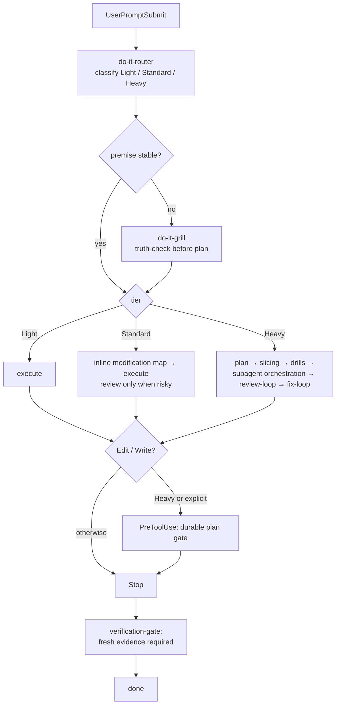
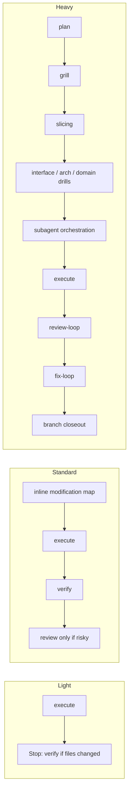

# do-it Workflow

[English](./README.md) | [中文](./README.zh-CN.md)

[](https://www.npmjs.com/package/@tdwhere/do-it)
[](LICENSE)

> Hook-enforced AI delivery workflow — route by risk, orchestrate sub-agents
> through skills, verify before claiming done.

`do-it` packages the operating habits that keep AI-assisted software delivery
useful, and wires them into the host (Codex or Claude Code) as hooks so the
discipline does not depend on any agent remembering to run a slash command.

## Standing on shoulders

`do-it` builds on the **plan / subworker / TDD / review** pattern that two
high-quality projects already proved out:

- [`obra/superpowers`](https://github.com/obra/superpowers) — skill + subworker
  collaboration model
- [`mattpocock/skills`](https://github.com/mattpocock/skills) — skill packaging
  and discovery

`do-it` is my own take on the same problem space, shaped by what I learned from
those projects. Three things I deliberately changed:

1. **Front-loaded discipline.** `router`, `grill`, and `context` move
   truth-checking *before* planning, not as a side note inside it.
2. **Three tiers designed separately, not as intensity dials.** `Light`,
   `Standard`, and `Heavy` each pick their own minimum-useful set of steps.
   Light is not "Heavy with stuff turned off."
3. **Sub-agent orchestration as a contract skill.** Every delegated agent gets
   six explicit fields — *scope, write ownership, forbidden paths, must-verify,
   stop condition, return schema* — filled in by the parent. No external
   scheduler, no agent runtime, no rule engine.

## The flow



## Walking the flow

Each step here is followed by a short *Why this is here* note. The design
choices live next to the steps they affect, not in a separate philosophy
document.

### 1. `UserPromptSubmit` → `do-it-router`

The first thing the host sees on every prompt is the router. It classifies the
work as `Light`, `Standard`, or `Heavy`, names the minimum useful skill + agent
set, and forecasts likely failure modes.

> **Why this is here.** Prompts arrive without a tier label, and an agent
> picking a tier "by feel" is the most common source of wrong-sized work — a
> two-line fix routed as Heavy never ships, a release routed as Light ships
> broken. Putting classification at the host's first hook means the agent can
> not skip it.

### 2. `router` → `do-it-grill` (when the premise looks shaky)

If the prompt has uncertainty markers, an explicit grill request, or long
plan-like input, the router fires `do-it-grill`: pressure-test the premise,
list assumptions and their falsifiers, and require evidence before planning.

> **Why this is here.** The plan / TDD / review pattern starts at *plan*. But
> if the premise feeding plan is wrong, every later step is doing the right
> thing on the wrong basis. `grill` makes "what is actually true right now"
> a precondition for planning, not a discovery during it.

### 3. Tier dispatch — designed separately, not as an intensity dial

The three tiers are not the same process at three intensities. Each one is
its own design.



- **`Light`** — execute, then verify if anything changed. No plan. No review.
  > **Why so spare.** Adding ceremony to a single-file fix or a docs tweak
  > makes the ceremony cost more than the change. Heavy-flavored Light scares
  > people away from making correct small changes.
- **`Standard`** — inline modification map → execute → verify → review only
  when the change carries real risk.
  > **Why review is risk-triggered.** The real cost in ordinary work is
  > missing a single edge condition, so review needs to *exist* but not be
  > mandatory. Mandatory review on every Standard change trains people to
  > rubber-stamp.
- **`Heavy`** — plan → grill → slicing → targeted drills → subagent
  orchestration → execution → right-sized review-loop → fix-loop → closeout.
  > **Why everything is on.** High-risk changes have the highest rework cost,
  > and rework after merge is more expensive than ceremony before merge.

Full policy: [`docs/routing-matrix.md`](./docs/routing-matrix.md).

### 4. Sub-agent orchestration — a skill, not a runtime

Delegated agents drift. They write outside their slice, return free-form text
the parent has to re-parse, and quietly invent assumptions. `do-it`'s answer
is the `do-it-subagent-orchestration` skill: every delegation must fill six
fields before it goes out.

| Field | What it pins down |
|---|---|
| `scope` | The single bounded outcome the sub-agent owns. |
| `write ownership` | Which paths the sub-agent is allowed to edit. |
| `forbidden paths` | Which paths the sub-agent must not touch, even if it would help. |
| `must-verify facts` | Concrete claims the sub-agent must confirm against the repo before acting. |
| `stop condition` | The exact event that ends the sub-agent's run. |
| `return schema` | The structured shape of its final report. |

> **Why a skill, not an external orchestrator.** Sub-agent control is not a
> scheduling problem; it is a contract problem. Once the six fields above are
> filled, there is nothing for an external runtime to add — and an external
> runtime introduces the same drift problem one level up (who controls the
> orchestrator?). Keeping it as a skill means the parent agent stays
> responsible, the contract is human-readable in the prompt, and any host that
> can run skills can run the orchestration.

This is the part of `do-it` I care most about. Front-loading and tier dispatch
make sure the work is correctly framed; sub-agent contracts make sure that
framing actually survives delegation.

### 5. `PreToolUse(Edit | Write)` — durable plan gate

For Heavy work or explicitly requested durable plans, the host's
`PreToolUse(Edit | Write)` hook blocks the actual file write until the plan
card exists.

> **Why a hook, not a guideline.** "Open the plan file before editing" works
> for one round and breaks down by round three. The hook puts the gate at the
> tool boundary, where it cannot be forgotten.

### 6. `Stop` → `do-it-verification-gate`

When the agent declares the turn done, the `Stop` hook checks for fresh
verification output. No evidence, no completion claim.

> **Why block at `Stop`.** "I'm done" is the position where an agent is most
> likely to overstate confidence. Anchoring done-ness to a *fresh* command
> output keeps the agent's belief and the repository's actual state in sync.

## What you don't need to remember

- **No slash command vocabulary.** Hooks fire skills at the right host
  lifecycle event. You write a normal prompt; the workflow attaches itself.
- **No external orchestration runtime.** Sub-agent control lives in
  `do-it-subagent-orchestration`, which is just a skill.
- **One-turn bypass.** Include `yolo`, `直接做`, `skip grill`, or
  `/do-it-skip` in the prompt to disable hooks for that turn only.

## What's in the package

- A three-tier routing model for `Light`, `Standard`, and `Heavy` work.
- do-it-native skills for routing, grill, context, planning, slicing,
  interface / architecture / domain drills, sub-agent orchestration, TDD,
  debugging, review, fix loops, verification, worktree isolation, branch
  closeout, visual planning, and skill authoring.
- Portable Codex agent definitions (TOML) for code mapping, plan challenge,
  correctness review, architecture review, red-team review, spec compliance,
  domain language, install/release review, documentation, testing, and
  language-specific drills.
- Copy-based installer and `doctor` commands that validate the managed Codex
  home entries against `manifest.json`.
- A release surface that works from a local checkout, a packed tarball, a
  GitHub repository, or the npm registry.

## Install From npm

Install the CLI globally, then run setup:

```bash
npm install -g @tdwhere/do-it
do-it setup
```

`do-it setup` runs `do-it install` followed by `do-it doctor`.

- `do-it install` copies the managed skills and agents into `CODEX_HOME`.
- `do-it doctor` checks that the installed files and install state match the
  package manifest.
- `CODEX_HOME` defaults to `~/.codex`.

Use a temporary Codex home when testing an install:

```bash
CODEX_HOME=/tmp/do-it-codex-test do-it setup
```

The installer will not silently replace user-owned skill or agent files. If it
finds a target that is not already marked as do-it-managed, it stops. Set
`DO_IT_FORCE=1` only when you intentionally want the package to replace those
targets.

## Install In Claude Code

`do-it` ships as a Claude Code plugin. Install via the plugin marketplace:

```text
/plugin marketplace add tdwhere123/do-it
/plugin install do-it
```

Or via the CLI (when not using marketplace):

```bash
do-it install --target=claude
do-it doctor --target=claude
```

The Claude target installs to `~/.claude/` by default; override with
`CLAUDE_PLUGIN_ROOT_OVERRIDE`. Optional skills (e.g. `do-it-visual-planning`)
are excluded by default — opt in with `--with-optional`.

The Claude target wires the three hooks described above. There are no slash
commands to remember.

## Install Before Registry Publication

For a GitHub-hosted package:

```bash
npm install -g github:OWNER/do-it
do-it setup
```

For a packed release artifact:

```bash
npm pack
npm install -g ./tdwhere-do-it-0.5.1.tgz
do-it setup
```

## Local Development

From a checkout, use the package entrypoint:

```bash
npm exec --package . -- do-it setup
npm exec --package . -- do-it install
npm exec --package . -- do-it doctor
```

Equivalent package scripts are also available:

```bash
npm run setup
npm run install:do-it
npm run doctor
npm run do-it -- doctor
```

The shell wrappers remain for direct installer testing and delegate to the same
managed install behavior:

```bash
./install/install.sh
./install/doctor.sh
```

This package does not use npm lifecycle scripts to modify `~/.codex`.
Installation into Codex happens only when the operator runs `do-it setup` or
`do-it install`.

Before sending hook changes for review, run `npm run lint` (shellcheck via
`scripts/lint-hooks.sh`). `npm test` runs hook lint plus the hook regression
suite in `scripts/test-hooks.sh`. CI runs the lint script on push / PR.

## Repository Layout

```text
agents/          Portable Codex agent TOML definitions
bin/             The global do-it CLI entrypoint
docs/            Routing, maintenance, origin map, and release notes
install/         Installer, doctor, and shell wrapper entrypoints
skills/custom/   Local skill examples that are not installed by default
skills/do-it/    Installed do-it-native skill directories
manifest.json    Install inventory and target paths
package.json     npm package metadata and CLI scripts
```

The private `.do-it/` directory is for local plans, notes, and scratch
artifacts. It is ignored by Git and is not installed.

## Upgrading to 0.5.1

`do-it 0.5.1` keeps the 0.5.0 keyword hardening and trims the default flow:
Standard prompts no longer auto-grill just because they contain an intent verb,
long-input grill requires both length and a planning/spec hint, question turns
no longer leave a sticky skip state, and Standard source edits can use an
inline modification map instead of a required `.do-it/plans/*` file.

Heavy work still auto-triggers the grill and still uses durable planning when
release, policy, migration, broad interface, or architecture risk justifies it.
Review is risk-budgeted: Light/docs-only stays local, Standard uses at most one
focused reviewer when needed, and Heavy release/workflow work defaults to the
two lenses that matter here: skill/policy quality plus install/release
readiness.

Existing 0.4.x users do nothing special — `do-it install` detects the older
state, backs it up to `.pre-migrate.json`, and migrates silently. See
[`install/migrations/0.4-to-0.5.md`](./install/migrations/0.4-to-0.5.md) for
the breakdown. Use `do-it install --no-migrate` if you want to fail loudly
instead of migrating.

Debugging hooks: `DO_IT_DEBUG=1` makes each hook emit one stderr line per
decision (escape / skip / question / tier / trigger / evidence). Inspect
session state with `do-it doctor --session=<id>`.

## Maintenance

Use [docs/maintenance.md](./docs/maintenance.md) when changing skills, agents,
installer behavior, or package metadata. In short:

1. Edit the maintained repository copy.
2. Update `manifest.json` when install inventory changes.
3. Keep `docs/routing-matrix.md` aligned with routing or closeout policy
   changes.
4. Verify with a temporary `CODEX_HOME`.
5. Publish only after the packed package contains the expected files.

Useful release checks:

```bash
git diff --check
npm test
npm run build:claude-agents
CODEX_HOME=/tmp/do-it-codex-test npm exec --package . -- do-it setup
CODEX_HOME=/tmp/do-it-codex-test npm exec --package . -- do-it doctor
CLAUDE_PLUGIN_ROOT_OVERRIDE=/tmp/do-it-claude-test npm exec --package . -- do-it setup --target=claude
npm pack --dry-run --json
```

## Contributing

`do-it` only accepts changes that came out of real use. See
[CONTRIBUTING.md](./CONTRIBUTING.md) for the two hard rules (dogfood-first,
Issue-first), the exception list (typo / translation / reproducible bug fix),
and the PR template.
