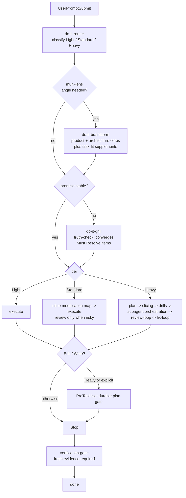

# do-it

[English](./README.md) | [中文](./README.zh-CN.md)

[](https://github.com/tdwhere123/do-it/actions/workflows/ci.yml)
[](https://github.com/tdwhere123/do-it/actions/workflows/codeql.yml)
[](LICENSE)

> Stop asking AI agents to remember process. Install it.

`do-it` turns AI coding discipline into an installable workflow for Codex and
Claude Code. It routes work by risk, delegates sub-agents with explicit
contracts, and requires fresh evidence before an agent can claim done.

This is the workflow I use every day for real project work. If it fits your
style, use it. If something feels wrong, open an issue, send a PR, or fork it
and reshape it for your own agent setup.

## The Three Moves

### Route the work

Every prompt is classified as `Light`, `Standard`, or `Heavy` before the agent
starts acting.

- `Light`: small local edits, docs tweaks, one-off checks.
- `Standard`: normal non-trivial engineering work.
- `Heavy`: releases, architecture changes, cross-module policy, public
  workflow changes, or multi-agent delivery.

The point is not more ceremony. The point is matching the process to the risk:
small work should stay small, and risky work should not skip planning, review,
or proof.

### Contract the delegation

Sub-agents are useful only when the parent gives them a real boundary. `do-it`
treats delegation as a contract, not a scheduling problem.

Every delegated slice pins down:

| Field | What it pins down |
|---|---|
| `scope` | The single bounded outcome the sub-agent owns. |
| `write ownership` | Which paths the sub-agent is allowed to edit. |
| `forbidden paths` | Which paths the sub-agent must not touch, even if it would help. |
| `must-verify facts` | Concrete claims the sub-agent must confirm before acting. |
| `stop condition` | The exact event that ends the sub-agent's run. |
| `return schema` | The structured shape of its final report. |

No external orchestrator is required. The parent agent stays responsible, and
the contract is plain text that any host with skills and sub-agents can use.

### Prove the result

`do-it` treats "done" as an evidence claim. If files changed, the agent needs
fresh verification output before it can claim the task is complete.

That keeps the closeout tied to the repository's actual state, not the agent's
confidence.

## Codex Global Setup

Recommended when you want the full automatic workflow in Codex: skills,
agents, global hooks, and `doctor` managed from one explicit command.

Install the CLI globally from this GitHub repository, then run setup:

```bash
npm install -g https://github.com/tdwhere123/do-it/archive/refs/heads/main.tar.gz
do-it setup
```

This uses `npm` as the terminal installer, but the package is downloaded from
GitHub's source tarball rather than the npm registry.

`do-it setup` runs `do-it install` followed by `do-it doctor`.

- `do-it install` copies managed skills, agents, hook scripts, and Codex root
  `hooks.json` into the target host.
- `do-it doctor` checks that installed files and install state match
  `manifest.json`.
- Codex installs to `CODEX_HOME`, which defaults to `~/.codex`.
- Codex global hooks use `UserPromptSubmit`, `PreToolUse`, `PostToolUse`, and
  `Stop` to route, pressure-test, refresh code maps, and require verification.

Use a temporary Codex home when testing an install:

```bash
CODEX_HOME=/tmp/do-it-codex-test do-it setup
```

The installer will not silently replace user-owned skill or agent files. If it
finds a target that is not already marked as do-it-managed, it stops. Set
`DO_IT_FORCE=1` only when you intentionally want the package to replace those
targets.

## Codex Plugin Marketplace

`do-it` also publishes a Codex plugin marketplace shape for first-class
discovery of its skills and agents:

```bash
codex plugin marketplace add tdwhere123/do-it
```

For a local checkout smoke test, use the checkout path as the marketplace
source with a temporary `CODEX_HOME`:

```bash
CODEX_HOME=/tmp/do-it-plugin-test codex plugin marketplace add /path/to/do-it
```

The Codex plugin bundle lives at `plugins/do-it/` and is generated from
`manifest.json`. It includes 23 skills and 23 agents, including optional
`do-it-visual-planning`.

For v1, pair plugin installation with `do-it setup` when you need enforced
automatic hooks. Local `codex features list` currently reports
`codex_hooks=true`, `plugins=true`, and `plugin_hooks=false`, so plugin-local
hooks are not the enforcement substrate.

## Claude Code

`do-it` also ships as a Claude Code plugin. Install via the plugin marketplace:

```text
/plugin marketplace add tdwhere123/do-it
/plugin install do-it
```

Or use the CLI target when not using marketplace:

```bash
do-it install --target=claude
do-it doctor --target=claude
```

The Claude target installs to `~/.claude/` by default; override with
`CLAUDE_PLUGIN_ROOT_OVERRIDE`. Optional skills such as
`do-it-visual-planning` are excluded by default; opt in with
`--with-optional`.

## What It Installs

- do-it-native skills for routing, grill, **brainstorm (multi-lens
  divergence)**, **handbook (project doc skeleton)**, context, planning,
  slicing, interface / architecture / domain drills, sub-agent orchestration,
  TDD, debugging, review, fix loops, verification, worktree isolation, branch
  closeout, visual planning, and skill authoring.
- Portable Codex agent definitions for code mapping, plan challenge,
  correctness review, architecture review, red-team review, spec compliance,
  domain language, install/release review, documentation, testing,
  language-specific drills, and **brainstorm lenses**: the required
  `product-strategist` / `architecture-strategist` cores for product
  boundary, core goal, foundation, and extension shape, plus optional product,
  UX, end-user, ops, security, domain, and plan supplements.
- Codex global hook assets and root `hooks.json` installed by `do-it setup`.
  Hooks include a **PostToolUse `code-map-refresh`** that marks
  `.do-it/handbook/code-map.md` stale on barrel / migration / route /
  workspace-manifest edits.
- Claude Code plugin assets, hooks, commands, and generated sub-agent
  definitions.
- Copy-based installer and `doctor` commands that validate managed host files
  against `manifest.json`.
- A release surface that works from a local checkout, a packed tarball, a
  GitHub repository, a GitHub-backed terminal install, or a Codex plugin
  marketplace.

## The Flow



In practice:

1. `do-it-router` classifies the task and names the smallest useful workflow.
2. `do-it-brainstorm` runs for product, architecture, workflow, and
   release-adjacent work. It first clarifies the requirement shape, product
   boundary, core goal, architecture foundation, extension modules, and option
   tradeoffs, then adds only the task-fit supplements needed for UX, end-user,
   ops, security, domain language, or plan-risk questions.
3. `do-it-grill` fires when the premise needs pressure-testing. When a
   brainstorm artifact exists, grill enters convergence mode and resolves
   `Must Resolve In Grill` instead of restarting divergence.
4. `Light`, `Standard`, and `Heavy` use different flows, not the same flow at
   different intensities.
5. Heavy or explicitly durable work can be blocked at the write boundary
   until a plan exists.
6. The stop gate checks for fresh evidence before completion claims.

Full routing policy: [`docs/routing-matrix.md`](./docs/routing-matrix.md).

## What You Do Not Need To Remember

- No slash command vocabulary for the automatic path. Codex global setup and
  the Claude Code plugin install hooks at the host lifecycle points where they
  matter.
- No external orchestration runtime. Sub-agent control lives in
  `do-it-subagent-orchestration`, which is just a skill.
- One-turn bypass. Include `yolo`, `直接做`, `skip grill`, or `/do-it-skip` in
  the prompt to disable hooks for that turn only.

## Alternative Install Sources

For a packed local release artifact:

```bash
npm pack
npm install -g ./tdwhere-do-it-0.7.0.tgz
do-it setup
```

## Local Development

From a checkout, use the package entrypoint:

```bash
npm exec --package . -- do-it setup
npm exec --package . -- do-it install
npm exec --package . -- do-it doctor
```

Equivalent package scripts are also available:

```bash
npm run setup
npm run install:do-it
npm run doctor
npm run do-it -- doctor
```

The shell wrappers remain for direct installer testing and delegate to the same
managed install behavior:

```bash
./install/install.sh
./install/doctor.sh
```

This package does not use npm lifecycle scripts to modify `~/.codex`.
Installation into Codex happens only when the operator runs `do-it setup` or
`do-it install`.

Before sending hook changes for review, run `npm run lint` (shellcheck via
`scripts/lint-hooks.sh`). `npm test` runs agent schema / generated-inventory
validation, hook lint, and the hook regression suite in `scripts/test-hooks.sh`.
CI runs the Node matrix, generated-agent build check, Codex and Claude install
smoke tests, and package dry run on push and PR.

## Repository Layout

```text
agents/          Portable Codex agent TOML definitions
.agents/plugins/ Codex marketplace metadata
bin/             The global do-it CLI entrypoint
commands/        Claude Code command surface
dist/claude/     Generated Claude Code agent definitions
docs/            Routing, maintenance, origin map, and release notes
hooks/           Host hook scripts
install/         Installer, doctor, and shell wrapper entrypoints
plugins/do-it/   Generated Codex plugin bundle
skills/custom/   Local skill examples that are not installed by default
skills/do-it/    Installed do-it-native skill directories
manifest.json    Install inventory and target paths
package.json     npm package metadata and CLI scripts
```

The private `.do-it/` directory is for local plans, notes, and scratch
artifacts. It is ignored by Git and is not installed.

## Upgrading to 0.7.0

`do-it install` handles the full upgrade. No project-level migration is
required.

**Hook noise reduction.** Light tier is now fully silent. Standard tier
requires both an intent-verb and a code-object match before injecting workflow
guidance. Subagents do not receive nested hook injection. SESSION_ID
validation rejects LF and control characters at the session boundary.

**Session persistence.** Session state moves from `/tmp` to
`.do-it/runtime/`. Skip tokens have a 5-minute TTL. A self-contained
`.gitignore` is written at install time. When `flock` is unavailable, PID-
tagged temp files and atomic `mv` prevent state corruption.

**Research-first architecture decisions.** `architecture-strategist` now
requires a live search and at least two concrete candidates before
recommending. A new `architecture-taste-reviewer` agent audits brainstorm
output for research compliance. Search results are treated as an untrusted
boundary to prevent prompt injection.

**Comments discipline.** Five comment types are allowed — type annotation,
`@anchor`, `see also`, invariant, tool directive — and six are forbidden —
narrative, history, task-reference, tombstone, orphan-TODO, what-comment. A
new `comments-lint` PostToolUse hook enforces this. The `review-loop` adds a
comments lens.

**Router dimension orthogonality.** Five `dim_*` booleans (`touches_code`,
`crosses_packages`, `breaks_interface`, `needs_tdd`, `needs_review_loop`) are
written to session state per task. Tier classification is unchanged; the
booleans drive which workflow steps fire.

**Graduated review.** Three review depths: `review-quick`, `review-deep`,
`review-adversarial`. The verification gate on Light tier with edits now emits
an inline-review marker to prevent a self-satisfying replay claim.

**Lazy skill loading.** A generated `dist/claude/skills/_index.md` (~720
tokens) replaces the large skill catalogue previously injected by the router.
Skills load on demand.

**Subagent token budgets.** Codex agent TOML stays schema-clean: no
`output_budget`, `claude_model`, or other host-private keys. Response budgets
live in `do-it-subagent-orchestration` and must be passed in the parent prompt.

**Test coverage.** 42 regression cases in `tests/hooks/` cover `common`,
`router`, `verification-gate`, and `comments-lint`.

Debugging hooks: `DO_IT_DEBUG=1` makes each hook emit one stderr line per
decision (escape / skip / question / tier / trigger / evidence). Inspect
session state with `do-it doctor --session=<id>`.

## Standing On Shoulders

`do-it` builds on the **plan / subworker / TDD / review** pattern that two
high-quality projects already proved out:

- [`obra/superpowers`](https://github.com/obra/superpowers): skill + subworker
  collaboration model.
- [`mattpocock/skills`](https://github.com/mattpocock/skills): skill packaging
  and discovery.

`do-it` is my own take on the same problem space, shaped by what I learned from
those projects and from daily use on real work.

Thanks also to the [Linux.do](https://linux.do) community. The conversations
there are a steady source of practical agent-workflow feedback and ideas.

## Maintenance

Use [docs/maintenance.md](./docs/maintenance.md) when changing skills, agents,
installer behavior, or package metadata. In short:

1. Edit the maintained repository copy.
2. Update `manifest.json` when install inventory changes.
3. Keep `docs/routing-matrix.md` aligned with routing or closeout policy
   changes.
4. Verify with a temporary `CODEX_HOME`.
5. Publish only after the packed package contains the expected files.

Useful release checks:

```bash
git diff --check
npm test
npm run validate:agents
npm run build:claude-agents
npm run build:codex-plugin
CODEX_HOME=/tmp/do-it-codex-test npm exec --package . -- do-it setup
CODEX_HOME=/tmp/do-it-codex-test npm exec --package . -- do-it doctor
CODEX_HOME=/tmp/do-it-plugin-test codex plugin marketplace add /path/to/do-it
CLAUDE_PLUGIN_ROOT_OVERRIDE=/tmp/do-it-claude-test npm exec --package . -- do-it setup --target=claude
npm pack --dry-run --json
```

## Contributing

Use `do-it` as-is, send focused improvements, or fork it into your own
workflow. The only hard requirement for changes here is that they come from
real use.

See [CONTRIBUTING.md](./CONTRIBUTING.md) for the two hard rules
(dogfood-first, Issue-first), the exception list (typo / translation /
reproducible bug fix), and the PR template.
