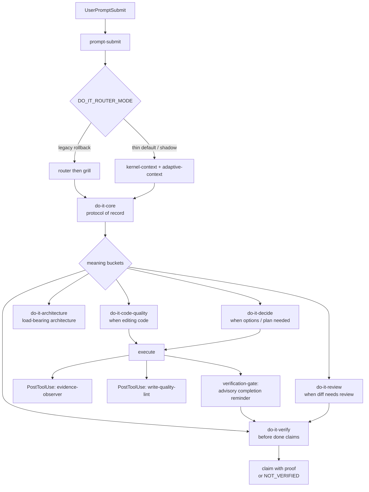

# do-it

[English](./README.md) | [中文](./README.zh-CN.md)

[](https://github.com/tdwhere123/do-it/actions/workflows/ci.yml)
[](https://github.com/tdwhere123/do-it/actions/workflows/codeql.yml)
[](LICENSE)

> Less is more. The best workflow is the one you don't notice until it saves you.

**do-it makes agent work evidence-carrying.** Every completion claim traces to a
goal, settled decisions, a boundary, acceptance, and fresh evidence on this
worktree.

Most AI coding workflows add rules. `do-it` starts from the opposite
direction: **what can the agent skip?** Small work stays small. No mandatory
brainstorm → grill → plan → review chain. Every skill, every sub-agent, every
hook earns its place by being useful *right now* — not by being part of a
pipeline. Autonomy stays first: direct user intent outranks hook labels.

What remains is lean and deliberate:

- **Every line of code is a liability before it's an asset.** A shared decision
  ladder asks "does this need to exist?" before "how should I build it?"
- **"Done" is an evidence claim, not a confidence level.** Show proof from the
  worktree, or say `NOT_VERIFIED`.
- **Advisory, never blocking.** Hooks nudge. Skills suggest. The agent's
  judgment — and yours — wins.

This is the workflow I use every day. If it fits your style, use it. If
something feels wrong, open an issue, send a PR, or fork it.

## Quick Start

### 1. Install

| Host | Command |
| --- | --- |
| Codex | `codex plugin marketplace add tdwhere123/do-it && codex plugin add do-it@tdwhere-do-it` |
| Claude Code | `/plugin marketplace add tdwhere123/do-it` → `/plugin install do-it@do-it` |
| Cursor | `npm run install:cursor-local` → Reload Window |
| OpenCode | `opencode plugin @tdwhere/do-it-opencode -g` |
| Pi | `pi install npm:@tdwhere/do-it-pi` |
| Kimi Code | `/plugins install https://github.com/tdwhere123/do-it` |

Per-host details and smoke tests: [docs/install.md](./docs/install.md).

### 2. Talk normally

do-it works behind the scenes. You don't invoke it — it fires at the right
lifecycle points:

- **Default runtime is thin** (unset or `DO_IT_ROUTER_MODE=thin`): a compact
  kernel plus an optional adaptive overlay; the lexical classifier is skipped.
  Rollback to the 0.16 router-then-grill path: `DO_IT_ROUTER_MODE=legacy`.
  `shadow` still injects the kernel while the classifier records diagnostics
  only. This is S16 Phase A in this worktree, not a tagged 0.19.
- **While writing**, `write-quality-lint` flags anti-patterns on new lines.
  One reminder per file; never blocks. `evidence-observer` records edit and
  command facts; a command name is not proof.
- **Before "done"**, the verification gate asks for fresh proof from this
  worktree.

### 3. Set up `.do-it/` (recommended)

A small directory that gives agents memory across sessions — project rules,
vocabulary, and working notes. Run:

```
/do-it-handbook init
```

This creates:

```
.do-it/
  handbook/            stable project truth
    invariants.md        rules that always win
    architecture.md      stable system shape
    glossary.md          long-stable vocabulary
  worklog/             daily or goal-scoped notes
  CONTEXT.md           terse terms and relationships (auto-updated)
  plans/               execution contracts when earned (not progress logs)
```

Fill in `invariants.md` and `glossary.md` with your project's actual rules.
The rest maintains itself. Bootstrap does **not** create `brainstorm/` or
`grill/`. Adaptive profiles and runtime event logs stay gitignored under
`.do-it/runtime/` (default off; never store secrets or project facts there).

### 4. Skip when you want to

`yolo`, `just do it`, `直接做`, `skip do-it`, or `/do-it-skip` — full bypass.
`skip grill`, `skip router`, `skip gate` — partial.

## How It Works

### Right-sized work

On the legacy rollback path (`DO_IT_ROUTER_MODE=legacy`), the router gives
every task an advisory risk label — not a permission gate. Thin (the default)
skips that classifier.

| Tier | What happens |
| --- | --- |
| **Light** | Inspect → act → check. No extra ceremony. |
| **Standard** | Load skills only when the task needs them. No mandatory chain. |
| **Heavy** | Cross-boundary, release, security, or irreversible. Earns scrutiny. |

Skills are loaded by need, not by tier:

| Skill | When |
| --- | --- |
| `do-it-core` | Always-on protocol of record — route the tier, then evidence / scope / verify / report |
| `do-it-code-quality` | Editing code — scope, TDD, debugging, contracts |
| `do-it-architecture` | Load-bearing architecture — authority, contracts, boundaries, cutover, guards |
| `do-it-decide` | Options unclear, load-bearing premises |
| `do-it-review` | Diff needs scrutiny and repair |
| `do-it-verify` | Before done / ready / merge claims |
| `do-it-handbook`, `do-it-context` | Project truth and glossary |
| `do-it-skill-authoring` | Writing do-it skills |
| `do-it-retrospective` | Opt-in behavior report (default off) |
| `do-it-adaptive` | On-demand personal overlay (default off; never weakens Core) |

### Less code, not more

A decision ladder runs through the whole write lifecycle:

> Does this need to exist at all? → Can stdlib do it? → A platform native?
> → An installed dependency? → One line? → Only then build it.

This isn't bolted on as a linter — it's wired into three points:

- **Before** writing: `do-it-decide` asks the necessity question.
- **While** writing: `do-it-code-quality` + `write-quality-lint` flag what
  should be simpler. ([Family catalog](./skills/do-it/references/write-quality-families.md).)
- **After** writing: `do-it-review` tags what can be deleted, inlined, or
  replaced by stdlib.

Safety is never what gets cut.

### Prove it or say so

`do-it` treats "done" as an evidence claim. `do-it-core` § Verify (with
`do-it-verify` as the checklist) asks for fresh, claim-specific proof from the
current worktree. If proof is unavailable, the honest answer is `NOT_VERIFIED`
with the next check named.

For external side effects (git push, npm publish …), do-it asks the agent to
confirm first. Only the host's sandbox can enforce that.
See [strict external actions](./docs/strict-external-actions.md).

> Tip: describe the goal, success criteria, and relevant constraints, then let
> the agent plan the steps.

### Delegate when it helps

Ten bundled sub-agents offer independent mapping, review, and specialist
views. Default dispatch is **0**. At most **one** fresh-context second look,
and only when independent evidence could change a costly decision, the slice
is narrow, or the current context is too anchored to audit itself. Your
global agents stay untouched by plugin updates.

## The Flow


```mermaid
flowchart TD
    P[UserPromptSubmit] --> PS[prompt-submit]
    PS --> M{DO_IT_ROUTER_MODE}
    M -->|thin default / shadow| K[kernel-context + adaptive-context]
    M -->|legacy rollback| R[router then grill]
    R --> C[do-it-core<br/>protocol of record]
    K --> C
    C --> B{meaning buckets}
    B --> CQ[do-it-code-quality<br/>when editing code]
    B --> A[do-it-architecture<br/>load-bearing architecture]
    B --> D[do-it-decide<br/>when options / plan needed]
    B --> RV[do-it-review<br/>when diff needs review]
    B --> VY[do-it-verify<br/>before done claims]
    CQ --> E[execute]
    D --> E
    E --> EO[PostToolUse: evidence-observer]
    E --> WQ[PostToolUse: write-quality-lint]
    E --> VG[verification-gate:<br/>advisory completion reminder]
    VG --> VY
    RV --> VY
    VY --> Done[claim with proof<br/>or NOT_VERIFIED]
```

Full routing policy: [`docs/routing-matrix.md`](./docs/routing-matrix.md).

## Project-Level Overrides

Project-level overrides live in `.do-it/` and are **data-only** — hooks read
them line by line and never source project files:

- `keywords.local.tsv` (session cwd) extends router keyword tables.
- `write-quality.local.tsv` (git root of the edited file) retunes numeric
  limits such as the `file-size` warn/split thresholds; the env vars
  `DO_IT_FILE_SIZE_WARN_LINES` / `DO_IT_FILE_SIZE_SPLIT_LINES` win over it.

Family catalog and suppression syntax:
[`skills/do-it/references/write-quality-families.md`](./skills/do-it/references/write-quality-families.md).

## Release Notes

The published line is **0.16.x**. Unreleased 0.17 work (skills, contracts,
eval, runtime observe) is documented in [`CHANGELOG.md`](./CHANGELOG.md).
This worktree default is **thin** (S16 Phase A, not a tagged 0.19). Rollback:
`DO_IT_ROUTER_MODE=legacy`. Tag policy:
[`docs/release.md`](./docs/release.md).

## Local Development

```bash
npm run setup            # optional CLI install
npm run doctor           # verify install
npm run lint             # shellcheck hooks
npm test                 # full gate: builds + validators + all tests
```

Shell wrappers (`./install/install.sh`, `./install/doctor.sh`) delegate to the
same managed install behavior. This package does not use npm lifecycle scripts
to modify `~/.codex`.

## Repository Layout

```text
skills/do-it/    Installed skill directories (source of truth)
agents/          Portable agent TOML definitions
hooks/           Host hook scripts + data tables
commands/        Slash commands (Claude / Kimi)
plugins/         Generated per-host bundles (Codex, Cursor, OpenCode, Pi)
install/         Installer, doctor, shell wrappers
scripts/         Build, validation, smoke-test scripts
tests/           Hook, install, release, adapter test suites
docs/            Routing, maintenance, release, adapters
```

## Standing On Shoulders

`do-it` builds on the **plan / subworker / TDD / review** pattern from
[`mattpocock/skills`](https://github.com/mattpocock/skills),
[`addyosmani/agent-skills`](https://github.com/addyosmani/agent-skills), and
[`gsd-build/get-shit-done`](https://github.com/gsd-build/get-shit-done).
Row-by-row source map: [`docs/upstream-map.md`](./docs/upstream-map.md).

`do-it` is my own take on the same problem space, shaped by daily use on real
work. It rewrites methods into do-it-native Router / Tier / Skill language; it
does not vendor upstream skill text or install upstream skill names. Upstream
projects do not prove do-it works; absorbed ideas still have to earn their
place in this repo's behavior eval.

Thanks to the [Linux.do](https://linux.do) community for steady real-world
feedback.

## Maintenance

[docs/maintenance.md](./docs/maintenance.md) covers skill, agent, installer,
and package metadata changes.

## Contributing

Real use only. See [CONTRIBUTING.md](./CONTRIBUTING.md).
