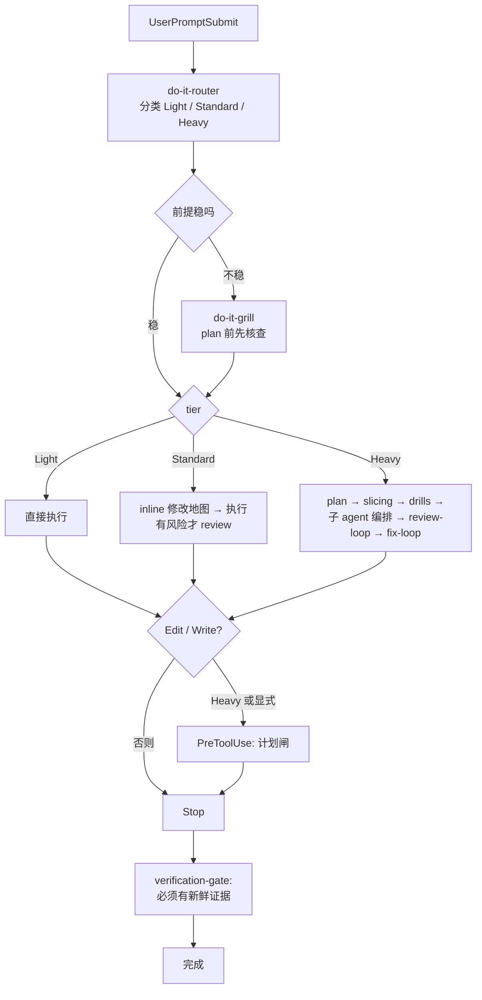
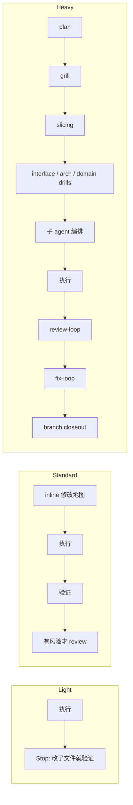

# do-it Workflow

[English](./README.md) | [中文](./README.zh-CN.md)

[](https://www.npmjs.com/package/@tdwhere/do-it)
[](LICENSE)

> 用 host hook 强制执行的 AI 交付工作流 —— 按风险路由、用 skill 编排子智能体、
> 没有证据不能宣布完成。

`do-it` 把那些「让 AI 协作真正可用」的工程习惯打成包，并把它们接到 host
（Codex 或 Claude Code）的 hook 上 —— 让纪律不再依赖 agent 主动想起来调用某个
斜杠命令。

## 站在前人的肩膀上

`do-it` 借用了已经被两个高质量项目验证过的 **plan / subworker / TDD / review**
范式：

- [`obra/superpowers`](https://github.com/obra/superpowers) —— skill + subworker
  协作模式
- [`mattpocock/skills`](https://github.com/mattpocock/skills) —— skill 的打包
  与发现机制

`do-it` 是我自己对同一类问题的解法，过程中从这两个项目里学到了很多经验。
有三件事是我刻意做了不同选择的：

1. **前置纪律强化**。`router`、`grill`、`context` 把真相核查放在 *plan 之前*，
   而不是在 plan 里顺带做。
2. **三档分别设计，不是同一流程的强弱档位**。`Light` / `Standard` / `Heavy`
   各自挑了最少必要的步骤。Light 不是「Heavy 关掉一些环节」。
3. **子智能体编排是一个契约 skill**。每次委派都必须填六个字段 —— *scope、
   write ownership、forbidden paths、must-verify、stop condition、
   return schema* —— 由父 agent 写好。不需要外部调度器，不需要 agent runtime，
   不需要规则引擎。

## 整体流程



## 走一遍流程

每一步后面都有一段「为什么这一步在这里」。设计理由就放在它影响的步骤旁边，
不另写一份独立的设计哲学。

### 1. `UserPromptSubmit` → `do-it-router`

host 接到 prompt 之后第一个看到的就是 router。它把任务分类成 `Light` /
`Standard` / `Heavy`，挑出最少必要的 skill + agent 集合，并预测可能的失败模式。

> **为什么这一步放这里。** prompt 不会自带 tier 标签，agent 凭直觉选档位是
> 最常见的错配源 —— 两行修复被走 Heavy 永远发不出去；发布任务被走 Light
> 上线就崩。把分类放在 host 的第一个 hook 上，agent 没机会跳过。

### 2. `router` → `do-it-grill`（前提不稳时）

如果 prompt 里有不确定信号、显式 grill 请求、或者长 plan 类输入，router 就触发
`do-it-grill`：压力测试前提，列出所有假设和它们的反证条件，要求拿到证据
再做 plan。

> **为什么这一步放这里。** plan / TDD / review 范式从 *plan* 开始；但如果
> 喂给 plan 的前提是错的，后面每一步都是「在错的基础上做正确的事」。`grill`
> 把「现状到底是什么」变成 plan 的前置条件，而不是 plan 中途的发现。

### 3. Tier 分流 —— 不是强弱档位，是分别设计

三档不是同一套流程的不同强度，而是各自有各自的设计。



- **`Light`** —— 直接执行，改了文件就验证。无 plan、无 review。
  > **为什么这么少。** 单文件修复或文档改动加上仪式，会让仪式比改动更贵；
  > Heavy 味道的 Light 会吓跑「正确的小改」。
- **`Standard`** —— inline 修改地图 → 执行 → 验证 → 有风险才 review。
  > **为什么 review 按风险触发。** 常规工作的真正成本在「漏看一个边界条件」，
  > 所以 review 要 *存在* 但不强制。每个 Standard 改动都强制 review 会把人
  > 训练成橡皮图章。
- **`Heavy`** —— plan → grill → slicing → 针对性 drills → 子 agent 编排 →
  执行 → 按规模 review-loop → fix-loop → closeout。
  > **为什么全开。** 高风险改动的 rework 成本最高，merge 后修比 merge 前
  > 走完整流程更贵。

完整策略见 [`docs/routing-matrix.md`](./docs/routing-matrix.md)。

### 4. 子智能体编排 —— 是 skill，不是 runtime

被委派的 agent 会漂移：写出范围之外的代码、返回需要父 agent 重新解析的自由文本、
偷偷自己造假设。`do-it` 的回答是 `do-it-subagent-orchestration` skill：每次
委派都必须先填六个字段。

| 字段 | 锁定的内容 |
|---|---|
| `scope` | 子 agent 拥有的那一个边界明确的产出。 |
| `write ownership` | 子 agent 被允许编辑的路径。 |
| `forbidden paths` | 子 agent 即使能帮上忙也不许碰的路径。 |
| `must-verify facts` | 子 agent 在动手之前必须用仓库实际状态确认的具体声明。 |
| `stop condition` | 触发子 agent 收尾的具体事件。 |
| `return schema` | 它最终回报的结构化形态。 |

> **为什么是 skill，不是外部 orchestrator。** 子 agent 的控制不是调度问题，
> 是契约问题。上面六个字段填完之后，就没有什么是外部 runtime 还能多做的 ——
> 而引入外部 runtime 反而把同样的漂移问题往上推一层（谁来约束 orchestrator？）。
> 留在 skill 这一层，父 agent 仍然负责，契约在 prompt 里就是人类可读的，任何
> 能跑 skill 的 host 都能跑这套编排。

这是 `do-it` 我最在意的部分。前置纪律和 tier 分流保证任务被正确装框；子 agent
契约保证这个框在委派之后还活着。

### 5. `PreToolUse(Edit | Write)` —— durable plan 闸

对 Heavy 任务或显式要求 durable plan 的场景，host 的
`PreToolUse(Edit | Write)` hook 会在真正写文件之前阻拦，直到 plan 卡片存在。

> **为什么是 hook，不是规范。** 「写代码前先打开 plan 文件」靠 agent 自觉，
> 第一轮还行，第三轮就崩了。把 hook 放在工具边界上，逻辑上没法绕过。

### 6. `Stop` → `do-it-verification-gate`

agent 宣布本轮结束时，`Stop` hook 会检查有没有刚生成的验证输出。没证据就
不能算完成。

> **为什么卡在 `Stop`。** 「我做完了」是 agent 最容易夸大自信的位置。把完成
> 状态绑到一段 *新鲜* 的命令输出，让 agent 的信念和仓库实际状态保持一致。

## 不需要你记住的事

- **没有要背的斜杠命令**。Hook 在合适的 host lifecycle 事件上自动触发 skill。
  你写正常 prompt，工作流自己挂上来。
- **没有外部 orchestration runtime**。子 agent 的控制就在
  `do-it-subagent-orchestration` 这一个 skill 里。
- **一次性跳过**：在 prompt 里写 `yolo` / `直接做` / `skip grill` /
  `/do-it-skip` 即可关掉这一轮的 hook。

## 这个包提供什么

- `Light` / `Standard` / `Heavy` 三层任务路由模型。
- do-it 原生 skill：路由、grill、context、planning、slicing、interface /
  architecture / domain drills、子智能体编排、TDD、调试、review、fix loop、
  verification、worktree 隔离、分支收口、视觉规划、skill 编写。
- 可移植的 Codex agent TOML 定义：代码路径映射、计划挑战、正确性审查、架构
  审查、红队审查、规格合规、领域语言、安装/发布审查、文档、测试和语言专项。
- 基于复制的安装器和 `doctor` 命令，用 `manifest.json` 校验 Codex home 中
  受管文件。
- 可从本地 checkout、打包产物、GitHub 仓库或 npm registry 使用的发布入口。

## 从 npm 安装

全局安装 CLI，然后运行 setup：

```bash
npm install -g @tdwhere/do-it
do-it setup
```

`do-it setup` 会先执行 `do-it install`，再执行 `do-it doctor`。

- `do-it install` 会把受管 skill 和 agent 复制到 `CODEX_HOME`。
- `do-it doctor` 会检查已安装文件和安装状态是否与包内 manifest 一致。
- `CODEX_HOME` 默认是 `~/.codex`。

测试安装行为时，建议使用临时 Codex home：

```bash
CODEX_HOME=/tmp/do-it-codex-test do-it setup
```

安装器不会静默覆盖用户自己的 skill 或 agent 文件。如果目标文件没有被标记为
do-it 受管文件，安装会停止。只有在你明确要替换这些目标时，才设置
`DO_IT_FORCE=1`。

## 安装到 Claude Code

`do-it` 是 Claude Code 插件。通过插件 marketplace 安装：

```text
/plugin marketplace add tdwhere123/do-it
/plugin install do-it
```

或者用 CLI（无 marketplace 时）：

```bash
do-it install --target=claude
do-it doctor --target=claude
```

Claude target 默认装到 `~/.claude/`；用 `CLAUDE_PLUGIN_ROOT_OVERRIDE` 改根目录。
可选 skill（如 `do-it-visual-planning`）默认不装，加 `--with-optional` 才装。

Claude target 接了上文那三个 hook，不需要记任何斜杠命令。

## registry 发布前的安装方式

如果包暂时托管在 GitHub：

```bash
npm install -g github:OWNER/do-it
do-it setup
```

如果要测试本地打包产物：

```bash
npm pack
npm install -g ./tdwhere-do-it-0.5.1.tgz
do-it setup
```

## 本地开发

在仓库 checkout 中，优先使用包入口：

```bash
npm exec --package . -- do-it setup
npm exec --package . -- do-it install
npm exec --package . -- do-it doctor
```

也可以使用等价的 package scripts：

```bash
npm run setup
npm run install:do-it
npm run doctor
npm run do-it -- doctor
```

保留的 shell wrapper 用于直接测试安装器，它们委托给同一套受管安装逻辑：

```bash
./install/install.sh
./install/doctor.sh
```

这个包不会通过 npm lifecycle scripts 自动修改 `~/.codex`。只有操作者显式
运行 `do-it setup` 或 `do-it install` 时，才会安装到 Codex。

修改 hook 之前提交 review 前，运行 `npm run lint`（通过 `scripts/lint-hooks.sh`
跑 shellcheck）。`npm test` 会跑 hook lint 加 `scripts/test-hooks.sh` 里的
hook 回归测试。CI 在 push / PR 上跑 lint 脚本。

## 仓库结构

```text
agents/          可移植的 Codex 智能体 TOML 定义
bin/             全局 do-it CLI 入口
docs/            路由、维护、来源映射和发布说明
install/         安装器、doctor 和 shell wrapper 入口
skills/custom/   默认不安装的本地 skill 示例
skills/do-it/    会被安装的 do-it 原生 skill 目录
manifest.json    安装清单和目标路径
package.json     npm 包元数据和 CLI scripts
```

私有 `.do-it/` 目录用于本地计划、笔记和临时材料。它被 Git 忽略，也不会被安装。

## 升级到 0.5.1

`do-it 0.5.1` 保留 0.5.0 的关键词收紧，同时把默认流程减重：Standard prompt
不再因为有 intent verb 就自动 grill；长输入必须同时满足长度和方案 / spec 类
hint 才触发 grill；问答 turn 不再留下 sticky skip state；Standard 源码编辑
可以用 inline modification map，不再强制先写 `.do-it/plans/*`。

Heavy 工作仍然会自动触发 grill；涉及发布、策略、迁移、广接口或架构风险时仍然
使用 durable plan。Review 改为按风险预算：Light / docs-only 本地审查；Standard
最多加 1 个聚焦 reviewer；Heavy release / workflow 默认只需要两条关键线：
skill/policy quality 和 install/release readiness。

0.4.x 老用户无需特殊操作 —— `do-it install` 会检测旧 state、备份到
`.pre-migrate.json`、再静默迁移。详见
[`install/migrations/0.4-to-0.5.md`](./install/migrations/0.4-to-0.5.md)。
如果想拒绝迁移，用 `do-it install --no-migrate`（会以退出码 2 失败）。

调试钩子：`DO_IT_DEBUG=1` 让每个 hook 在 stderr 上输出一行决策跟踪
（escape / skip / question / tier / trigger / evidence）。用
`do-it doctor --session=<id>` 查看会话状态。

## 维护说明

修改 skill、agent、安装器或包元数据时，参考 [docs/maintenance.md](./docs/maintenance.md)。
简要规则如下：

1. 修改仓库中的受维护副本。
2. 安装清单变化时同步更新 `manifest.json`。
3. 路由或收口策略变化时同步更新 `docs/routing-matrix.md`。
4. 用临时 `CODEX_HOME` 验证安装和 doctor。
5. 发布前确认打包产物包含预期文件。

常用发布检查：

```bash
git diff --check
npm test
npm run build:claude-agents
CODEX_HOME=/tmp/do-it-codex-test npm exec --package . -- do-it setup
CODEX_HOME=/tmp/do-it-codex-test npm exec --package . -- do-it doctor
CLAUDE_PLUGIN_ROOT_OVERRIDE=/tmp/do-it-claude-test npm exec --package . -- do-it setup --target=claude
npm pack --dry-run --json
```

## 贡献

`do-it` 只接受「真实使用之后产生的改动」。详见
[CONTRIBUTING.md](./CONTRIBUTING.md)：两条硬规则（先 dogfood、先 Issue）、
例外清单（typo / 翻译 / 可复现 bug fix），以及 PR 模板。
