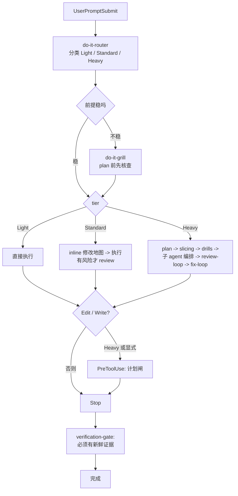

# do-it

[English](./README.md) | [中文](./README.zh-CN.md)

[](https://www.npmjs.com/package/@tdwhere/do-it)
[](LICENSE)

> 不要再要求 AI agent 记住流程。把流程装进去。

`do-it` 把 AI 编程协作里的工程纪律变成 Codex 和 Claude Code 可安装的工作流：
按风险选择流程、用明确契约委派子智能体、没有新鲜验证证据不能宣布完成。

这是我自己每天真实使用的工作流，用在实际项目里。如果它适合你的习惯，可以直接
用；如果你觉得哪里不对，欢迎提 issue、发 PR，或者 fork 后改造成自己的 agent
工作流。

## 三件事

### 按风险路由

agent 动手之前，先把任务分成 `Light`、`Standard` 或 `Heavy`。

- `Light`：小范围本地修改、文档微调、一次性检查。
- `Standard`：普通的非平凡工程任务。
- `Heavy`：发布、架构调整、跨模块策略、公开工作流变化，或多 agent 交付。

重点不是增加仪式，而是让流程匹配风险：小事保持小，大事不能跳过计划、审查和证据。

### 用契约委派

子智能体只有在边界清楚时才真正有用。`do-it` 把委派当成契约问题，而不是调度问题。

每个被委派的 slice 都要锁定：

| 字段 | 锁定的内容 |
|---|---|
| `scope` | 子 agent 拥有的那一个边界明确的产出。 |
| `write ownership` | 子 agent 被允许编辑的路径。 |
| `forbidden paths` | 子 agent 即使能帮上忙也不许碰的路径。 |
| `must-verify facts` | 子 agent 动手之前必须确认的具体声明。 |
| `stop condition` | 触发子 agent 收尾的具体事件。 |
| `return schema` | 它最终回报的结构化形态。 |

不需要外部 orchestrator。父 agent 仍然负责，契约就是普通文本；任何支持 skill
和子 agent 的 host 都能用。

### 用证据收口

`do-it` 把“完成”当成一个需要证据支持的声明。只要改了文件，agent 就需要拿到
新鲜验证输出，才能说任务完成。

这样收口状态绑定的是仓库实际状态，而不是 agent 的自信。

## 从 npm 安装

全局安装 CLI，然后运行 setup：

```bash
npm install -g @tdwhere/do-it
do-it setup
```

`do-it setup` 会先执行 `do-it install`，再执行 `do-it doctor`。

- `do-it install` 会把受管 skill 和 agent 复制到目标 host。
- `do-it doctor` 会检查已安装文件和安装状态是否与 `manifest.json` 一致。
- Codex 安装到 `CODEX_HOME`，默认是 `~/.codex`。

测试安装行为时，建议使用临时 Codex home：

```bash
CODEX_HOME=/tmp/do-it-codex-test do-it setup
```

安装器不会静默覆盖用户自己的 skill 或 agent 文件。如果目标文件没有被标记为
do-it 受管文件，安装会停止。只有在你明确要替换这些目标时，才设置
`DO_IT_FORCE=1`。

## Claude Code

`do-it` 也是 Claude Code 插件。通过插件 marketplace 安装：

```text
/plugin marketplace add tdwhere123/do-it
/plugin install do-it
```

或者在不使用 marketplace 时用 CLI target：

```bash
do-it install --target=claude
do-it doctor --target=claude
```

Claude target 默认装到 `~/.claude/`；用 `CLAUDE_PLUGIN_ROOT_OVERRIDE` 改根目录。
可选 skill（如 `do-it-visual-planning`）默认不装，加 `--with-optional` 才装。

## 它会安装什么

- do-it 原生 skill：路由、grill、context、planning、slicing、interface /
  architecture / domain drills、子智能体编排、TDD、调试、review、fix loop、
  verification、worktree 隔离、分支收口、视觉规划、skill 编写。
- 可移植的 Codex agent 定义：代码路径映射、计划挑战、正确性审查、架构审查、
  红队审查、规格合规、领域语言、安装/发布审查、文档、测试和语言专项。
- Claude Code 插件资产、hooks、commands 和生成后的子 agent 定义。
- 基于复制的安装器和 `doctor` 命令，用 `manifest.json` 校验受管 host 文件。
- 可从本地 checkout、打包产物、GitHub 仓库或 npm registry 使用的发布入口。

## 整体流程



实际运行时：

1. `do-it-router` 先给任务分类，并选择最小必要工作流。
2. 只有当前提需要先压力测试时，`do-it-grill` 才触发。
3. `Light`、`Standard` 和 `Heavy` 是三套不同流程，不是同一流程的强弱档。
4. Heavy 或显式要求 durable plan 的工作，会在写入边界前检查计划是否存在。
5. Stop gate 会在 agent 宣布完成前检查新鲜证据。

完整策略见 [`docs/routing-matrix.md`](./docs/routing-matrix.md)。

## 不需要你记住的事

- 没有要背的斜杠命令。Hook 在合适的 host lifecycle 事件上自动触发 skill。
- 没有外部 orchestration runtime。子 agent 的控制就在
  `do-it-subagent-orchestration` 这个 skill 里。
- 一次性跳过：在 prompt 里写 `yolo` / `直接做` / `skip grill` /
  `/do-it-skip` 即可关掉这一轮 hook。

## registry 发布前的安装方式

如果包暂时托管在 GitHub：

```bash
npm install -g github:OWNER/do-it
do-it setup
```

如果要测试本地打包产物：

```bash
npm pack
npm install -g ./tdwhere-do-it-0.5.1.tgz
do-it setup
```

## 本地开发

在仓库 checkout 中，优先使用包入口：

```bash
npm exec --package . -- do-it setup
npm exec --package . -- do-it install
npm exec --package . -- do-it doctor
```

也可以使用等价的 package scripts：

```bash
npm run setup
npm run install:do-it
npm run doctor
npm run do-it -- doctor
```

保留的 shell wrapper 用于直接测试安装器，它们委托给同一套受管安装逻辑：

```bash
./install/install.sh
./install/doctor.sh
```

这个包不会通过 npm lifecycle scripts 自动修改 `~/.codex`。只有操作者显式
运行 `do-it setup` 或 `do-it install` 时，才会安装到 Codex。

修改 hook 之前提交 review 前，运行 `npm run lint`（通过 `scripts/lint-hooks.sh`
跑 shellcheck）。`npm test` 会跑 hook lint 加 `scripts/test-hooks.sh` 里的
hook 回归测试。CI 在 push / PR 上跑 lint 脚本。

## 仓库结构

```text
agents/          可移植的 Codex 智能体 TOML 定义
bin/             全局 do-it CLI 入口
commands/        Claude Code command 入口
dist/claude/     生成后的 Claude Code agent 定义
docs/            路由、维护、来源映射和发布说明
hooks/           Host hook 脚本
install/         安装器、doctor 和 shell wrapper 入口
skills/custom/   默认不安装的本地 skill 示例
skills/do-it/    会被安装的 do-it 原生 skill 目录
manifest.json    安装清单和目标路径
package.json     npm 包元数据和 CLI scripts
```

私有 `.do-it/` 目录用于本地计划、笔记和临时材料。它被 Git 忽略，也不会被安装。

## 升级到 0.5.1

`do-it 0.5.1` 保留 0.5.0 的关键词收紧，同时把默认流程减重：Standard prompt
不再因为有 intent verb 就自动 grill；长输入必须同时满足长度和方案 / spec 类
hint 才触发 grill；问答 turn 不再留下 sticky skip state；Standard 源码编辑
可以用 inline modification map，不再强制先写 `.do-it/plans/*`。

Heavy 工作仍然会自动触发 grill；涉及发布、策略、迁移、广接口或架构风险时仍然
使用 durable plan。Review 改为按风险预算：Light / docs-only 本地审查；Standard
最多加 1 个聚焦 reviewer；Heavy release / workflow 默认只需要两条关键线：
skill/policy quality 和 install/release readiness。

0.4.x 老用户无需特殊操作：`do-it install` 会检测旧 state、备份到
`.pre-migrate.json`、再静默迁移。详见
[`install/migrations/0.4-to-0.5.md`](./install/migrations/0.4-to-0.5.md)。
如果想拒绝迁移，用 `do-it install --no-migrate`（会以退出码 2 失败）。

调试钩子：`DO_IT_DEBUG=1` 让每个 hook 在 stderr 上输出一行决策跟踪
（escape / skip / question / tier / trigger / evidence）。用
`do-it doctor --session=<id>` 查看会话状态。

## 站在前人的肩膀上

`do-it` 借用了已经被两个高质量项目验证过的 **plan / subworker / TDD / review**
范式：

- [`obra/superpowers`](https://github.com/obra/superpowers)：skill + subworker
  协作模式。
- [`mattpocock/skills`](https://github.com/mattpocock/skills)：skill 的打包
  与发现机制。

`do-it` 是我自己对同一类问题的解法，来自这些项目给我的启发，也来自我每天在
真实项目里的使用。

## 维护说明

修改 skill、agent、安装器或包元数据时，参考 [docs/maintenance.md](./docs/maintenance.md)。
简要规则如下：

1. 修改仓库中的受维护副本。
2. 安装清单变化时同步更新 `manifest.json`。
3. 路由或收口策略变化时同步更新 `docs/routing-matrix.md`。
4. 用临时 `CODEX_HOME` 验证安装和 doctor。
5. 发布前确认打包产物包含预期文件。

常用发布检查：

```bash
git diff --check
npm test
npm run build:claude-agents
CODEX_HOME=/tmp/do-it-codex-test npm exec --package . -- do-it setup
CODEX_HOME=/tmp/do-it-codex-test npm exec --package . -- do-it doctor
CLAUDE_PLUGIN_ROOT_OVERRIDE=/tmp/do-it-claude-test npm exec --package . -- do-it setup --target=claude
npm pack --dry-run --json
```

## 贡献

你可以直接使用 `do-it`，也可以提交聚焦改进，或者 fork 成自己的工作流。这里接受
改动的唯一硬要求是：它来自真实使用。

详见 [CONTRIBUTING.md](./CONTRIBUTING.md)：两条硬规则（先 dogfood、先 Issue）、
例外清单（typo / 翻译 / 可复现 bug fix），以及 PR 模板。
