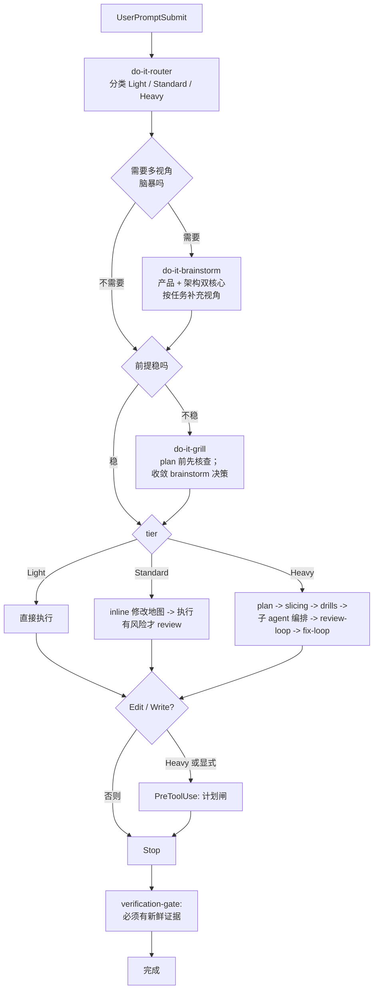

# do-it

[English](./README.md) | [中文](./README.zh-CN.md)

[](https://github.com/tdwhere123/do-it/actions/workflows/ci.yml)
[](https://github.com/tdwhere123/do-it/actions/workflows/codeql.yml)
[](LICENSE)

> 不要再要求 AI agent 记住流程。把流程装进去。

`do-it` 把 AI 编程协作里的工程纪律变成 Codex 和 Claude Code 可安装的工作流：
按风险选择流程、用明确契约委派子智能体、没有新鲜验证证据不能宣布完成。

这是我自己每天真实使用的工作流，用在实际项目里。如果它适合你的习惯，可以直接
用；如果你觉得哪里不对，欢迎提 issue、发 PR，或者 fork 后改造成自己的 agent
工作流。

## 四件事

### 按风险路由

agent 动手之前，先把任务分成 `Light`、`Standard` 或 `Heavy`。

- `Light`：小范围本地修改、文档微调、一次性检查。
- `Standard`：普通的非平凡工程任务。
- `Heavy`：发布、架构调整、跨模块策略、公开工作流变化，或多 agent 交付。

重点不是增加仪式，而是让流程匹配风险：小事保持小，大事不能跳过计划、审查和证据。

### 用契约委派

子智能体只有在边界清楚时才真正有用。`do-it` 把委派当成契约问题，而不是调度问题。

每个被委派的 slice 都要锁定：

| 字段 | 锁定的内容 |
|---|---|
| `scope` | 子 agent 拥有的那一个边界明确的产出。 |
| `write ownership` | 子 agent 被允许编辑的路径。 |
| `forbidden paths` | 子 agent 即使能帮上忙也不许碰的路径。 |
| `must-verify facts` | 子 agent 动手之前必须确认的具体声明。 |
| `stop condition` | 触发子 agent 收尾的具体事件。 |
| `return schema` | 它最终回报的结构化形态。 |

不需要外部 orchestrator。父 agent 仍然负责，契约就是普通文本；任何支持 skill
和子 agent 的 host 都能用。

### 用证据收口

`do-it` 把“完成”当成一个需要证据支持的声明。只要改了文件，agent 就需要拿到
新鲜验证输出，才能说任务完成。

这样收口状态绑定的是仓库实际状态，而不是 agent 的自信。

### 让代码尽量少

`do-it` 把每一行代码都先当成负债，再当成资产。一条共享的**决策阶梯**贯穿整个写代码
生命周期：它需不需要存在？→ stdlib 能做吗？→ 平台原生有吗？→ 已装依赖能做吗？→
能一行吗？→ 才轮到最小自建。命中第一个成立的档就停。

它接在三个点上，而不是事后挂一个 linter：

- **写之前**，`do-it-grill` 第一问就是必要性拷问。
- **写之中**，router 的 Restraint 反射 + 一个非阻塞的写时 advisory 标出投机抽象。
- **写之后**，`do-it-review-loop` 的 YAGNI 镜头给出「可删 / 可内联 / 可用 stdlib 替代」
  的标签化发现。

被砍的永远不是安全：信任边界输入校验、防数据丢失的错误处理、安全、可达性都保留。

## Codex 全局 setup

如果你想在 Codex 里启用完整自动工作流，推荐走这个入口：skills、agents、
全局 hooks 和 `doctor` 都由显式命令管理。

从这个 GitHub 仓库全局安装 CLI，然后运行 setup：

```bash
npm install -g https://github.com/tdwhere123/do-it/archive/refs/heads/main.tar.gz
do-it setup
```

这里仍然使用 `npm` 作为终端安装器，但包会从 GitHub source tarball 下载，
不依赖 npm registry。

`do-it setup` 会先执行 `do-it install`，再执行 `do-it doctor`。

- `do-it install` 会把受管 skill、agent、hook 脚本和 Codex 根目录
  `hooks.json` 复制到目标 host。
- `do-it doctor` 会检查已安装文件和安装状态是否与 `manifest.json` 一致。
- Codex 安装到 `CODEX_HOME`，默认是 `~/.codex`。
- Codex 全局 hooks 使用 `UserPromptSubmit`、`PreToolUse`、`PostToolUse`
  和 `Stop` 做路由、前提压测、注入子 agent 姿态、旁路 lint 和验证闸。

测试安装行为时，建议使用临时 Codex home：

```bash
CODEX_HOME=/tmp/do-it-codex-test do-it setup
```

安装器不会静默覆盖用户自己的 skill 或 agent 文件。如果目标文件没有被标记为
do-it 受管文件，安装会停止。只有在你明确要替换这些目标时，才设置
`DO_IT_FORCE=1`。

## Codex Plugin Marketplace

`do-it` 也提供 Codex plugin marketplace 形态，让 skills 和 agents 能被
Codex 作为插件发现：

```bash
codex plugin marketplace add tdwhere123/do-it
```

本地 checkout 测试时，用 checkout 路径作为 marketplace source：

```bash
CODEX_HOME=/tmp/do-it-plugin-test codex plugin marketplace add /path/to/do-it
```

Codex plugin bundle 位于 `plugins/do-it/`，由 `manifest.json` 生成。
它包含 21 个 skill 和 23 个 agent。

v1 阶段，如果你需要强制自动 hooks，请把 plugin 安装和 `do-it setup` 配套使用。
当前本机 `codex features list` 显示 `codex_hooks=true`、`plugins=true`、
`plugin_hooks=false`，所以 plugin-local hooks 还不是强制执行基座。

## Claude Code

`do-it` 也是 Claude Code 插件。通过插件 marketplace 安装：

```text
/plugin marketplace add tdwhere123/do-it
/plugin install do-it
```

或者在不使用 marketplace 时用 CLI target：

```bash
do-it install --target=claude
do-it doctor --target=claude
```

Claude target 默认装到 `~/.claude/`；用 `CLAUDE_PLUGIN_ROOT_OVERRIDE` 改根目录。
`--with-optional` 会安装 manifest 中标记为 optional 的 skill（0.11.0 没有 optional skill）。

## 它会安装什么

- do-it 原生 skill：路由、grill、**brainstorm（多视角发散）**、
  **handbook（项目文档骨架）**、context、planning、slicing、interface /
  architecture / domain drills、**codebase design（深度模块词汇）**、子智能体
  编排、TDD、调试、review、fix loop、verification、worktree 隔离、分支收口、
  视觉规划、skill 编写。
- 可移植的 Codex agent 定义：代码路径映射、计划挑战、正确性审查、架构审查、
  红队审查、规格合规、领域语言、安装/发布审查、文档、测试、语言专项，以及
  **brainstorm 视角**：必选的 `product-strategist` / `architecture-strategist`
  双核心，用来澄清产品边界、核心目标、架构地基和扩展形态；再加上按任务选择的
  产品、UX、终端用户、运维、安全、领域语言和计划补充视角。
- Codex 全局 hook 资产和由 `do-it setup` 安装到根目录的 `hooks.json`。Hook
  包含父级路由 / grill 提示、轻量的 **subagent stance** 提醒、旁路 comments /
  YAGNI lint，以及完成验证闸。
- Claude Code 插件资产、hooks、commands 和生成后的子 agent 定义。
- 基于复制的安装器和 `doctor` 命令，用 `manifest.json` 校验受管 host 文件。
- 可从本地 checkout、打包产物、GitHub 仓库或 GitHub 终端安装使用的发布入口，
  也可以通过 Codex plugin marketplace 发现。

## 整体流程



实际运行时：

1. `do-it-router` 先给任务分类并写入 routing state；常规 Standard/Heavy
   不再输出可见 router banner。
2. 涉及产品、架构、工作流或发布相关的工作，并且路线需要发散视角时，
   `do-it-brainstorm` 在 grill 之前先澄清需求形态、产品边界、核心目标、架构
   地基、扩展模块和选项优劣。它**默认内联**跑产品和架构两个核心，只有 Heavy
   档或显式要求时才真正扇出独立子 agent；选项沿决策阶梯排开、偏向减法，再按
   任务补充 UX、终端用户、运维、安全、领域语言或计划风险视角。
3. 当前提需要先压力测试时，`do-it-grill` 触发：第一问就是必要性拷问——这到底
   需不需要存在——再尽量用读代码而非提问去证伪承重前提。当存在 brainstorm
   产物时，grill 进入收敛模式：把 `Must Resolve In Grill` 当成候选前提排序、
   逐项核验或留给用户决策，而不是重新发散。
4. `Light`、`Standard` 和 `Heavy` 是三套不同流程，不是同一流程的强弱档。
5. Heavy 或显式要求 durable plan 的工作，会在写入边界前检查计划是否存在。
6. Stop gate 会在 agent 宣布完成前检查新鲜证据。

完整策略见 [`docs/routing-matrix.md`](./docs/routing-matrix.md)。

## 不需要你记住的事

- 自动路径不需要背斜杠命令。Codex 全局 setup 和 Claude Code plugin 会在
  合适的 host lifecycle 事件上安装 hooks。
- 没有外部 orchestration runtime。子 agent 的控制就在
  `do-it-subagent-orchestration` 这个 skill 里。
- 一次性跳过：在 prompt 里写 `yolo` / `直接做` / `skip grill` /
  `/do-it-skip` 即可关掉这一轮 hook。

## 其它安装方式

如果要测试本地打包产物：

```bash
npm pack
npm install -g ./tdwhere-do-it-0.10.0.tgz
do-it setup
```

## 本地开发

在仓库 checkout 中，优先使用包入口：

```bash
npm exec --package . -- do-it setup
npm exec --package . -- do-it install
npm exec --package . -- do-it doctor
```

也可以使用等价的 package scripts：

```bash
npm run setup
npm run install:do-it
npm run doctor
npm run do-it -- doctor
```

保留的 shell wrapper 用于直接测试安装器，它们委托给同一套受管安装逻辑：

```bash
./install/install.sh
./install/doctor.sh
```

这个包不会通过 npm lifecycle scripts 自动修改 `~/.codex`。只有操作者显式
运行 `do-it setup` 或 `do-it install` 时，才会安装到 Codex。

修改 hook 之前提交 review 前，运行 `npm run lint`（通过 `scripts/lint-hooks.sh`
跑 shellcheck）。`npm test` 会跑 agent schema / generated-inventory 校验、
hook lint，以及 `scripts/test-hooks.sh` 里的 hook 回归测试。CI 会在 push /
PR 上跑 Node 矩阵、生成 agent 检查、Codex 和 Claude 安装 smoke test，以及
package dry run。

## 仓库结构

```text
agents/          可移植的 Codex 智能体 TOML 定义
.agents/plugins/ Codex marketplace 元数据
bin/             全局 do-it CLI 入口
commands/        Claude Code command 入口
dist/claude/     生成后的 Claude Code agent 定义
docs/            路由、维护、来源映射和发布说明
hooks/           Host hook 脚本
index.json       生成后的 skill/agent 发现清单
install/         安装器、doctor 和 shell wrapper 入口
plugins/do-it/   生成后的 Codex plugin bundle
skills/custom/   默认不安装的本地 skill 示例
skills/do-it/    会被安装的 do-it 原生 skill 目录
manifest.json    安装清单和目标路径
package.json     npm 包元数据和 CLI scripts
```

私有 `.do-it/` 目录用于本地计划、笔记和临时材料。它被 Git 忽略，也不会被安装。

## 升级到 0.10.0

`0.10.0` 是一次实际工作可靠性发布。它保持 skill 表面稳定，同时收紧真实工作
闭环：durable plan 可以携带 Evidence Ledger，readiness 声明必须命名 truth
plane，review 要验证完整 proof path，subagent lane 状态由父 agent 维护，
closeout 明确区分 source、package、temp install、live install 和 host
behavior。

Agent 模板现在是模型无关的。源 `agents/*.toml` 不再指定具体模型或
reasoning-effort 字段，Claude 生成的 agent 默认继承当前宿主模型。

## 升级到 0.9.0

`0.9.0` 是一个可靠性与纪律性发布。安装态迁移逻辑抽到 `install/migrate.mjs`
并有完整测试覆盖（`npm run test-install`）；未知迁移 action 现在直接报错,
不再留下半迁移状态;`do-it install` 与 `doctor` 会报告每个 target 的安装态
版本,让 Codex/Claude 之间的版本漂移可见。`verification-gate` Stop hook 把
编辑/证据/review-loop 检测收紧到当前 turn —— 上一个 turn 的痕迹不再能放行
当前未验证的 turn —— 注入文本也重写成简洁的单句指令。`do_it_emit_block` /
`do_it_emit_context` 在没有 `jq` 时仍能输出合法 JSON。陈旧 session 目录会在
7 天后清理。`do-it-router` 新增 `Integrity` 段 —— 失败是要追根因的线索,
不是要掩盖的症状 —— 被 `do-it-debugging`、`do-it-fix-loop`、
`do-it-verification-gate` 和子智能体派发合约引用。CI 测试任务现在也跑 macOS。
若某台机器缓存了 `0.8.0` 插件,请重装或刷新,让宿主加载新的 hook 和 skill。

## 升级到 0.8.0

`0.8.0` 把 0.7.0 引入的五个 `dim_*` 正交维度真正激活 — 每个维度现在都至少
有一个明确的消费者（`grill-prompt`、`verification-gate`，或子 SKILL 的
mandatory-trigger 段）。新增的 PostToolUse 旁路 hook `anti-patterns-lint`
扫三种粗粒度反模式：大段 bash `case` 列表（≥10 连续 `*"..."*` 分支）、
新增 JS/TS 导出但仓里没人引用、≥5 行连续代码块在同目录另一个文件出现。
从不阻塞，每次编辑只 emit 一个 `system-reminder`。`do-it-fix-loop` 默认
姿态改为「收齐全部 findings → 找共因 → 批处理或逐点」，不再「看一个修
一个」；`do-it-review-loop` 对应一次性发全部 findings。
`.do-it/runtime/pointer` 记录当前 task slug，新一轮 turn 能恢复状态。
`do-it-comments-discipline` SKILL 从 373 行瘦到 119 行。23 个 sub-agent
TOML 删除重复的 `Common protocol:` 段，统一指向
`do-it-subagent-orchestration`。如果机器缓存了 `0.7.3` plugin，需要重装或
刷新让宿主加载新文件。

## 升级到 0.7.3

`0.7.3` 把常规 Standard/Heavy 的 router 改为 state-only。router 只记录
tier 和 dimensions，真正需要压力测试时由 `grill-prompt` 输出可见提示。它也
收紧了 review、closeout、comments，以及 brainstorm/grill 指引里的 workflow
accountability。如果机器已经缓存了 `0.7.2` plugin，需要重新安装或刷新 plugin，
让宿主加载新的 hook 和 skill 文件。

## 升级到 0.7.2

`0.7.2` 修复 Claude Code plugin hooks 在 macOS 自带 Bash 3.2 下的兼容性。
如果机器已经缓存了 `0.7.1` plugin，需要重新安装或刷新 plugin，让 Claude
加载兼容的 hook 文件。

## 升级到 0.7.1

运行 `do-it install` 即可完成升级，无需项目侧迁移。

**Hook 降噪。** Light tier 完全静默。Standard tier 需要同时匹配 intent-verb
和 code-object 才注入工作流引导。子 agent 不再触发嵌套注入。SESSION_ID
校验会拒绝含 LF 或控制字符的 session。

**Session 持久化。** Session 状态从 `/tmp` 迁移到 `.do-it/runtime/`。skip
token 有效期为 5 分钟。安装时自动写入自包含的 `.gitignore`。`flock` 不可用
时，使用 PID-tagged 临时文件加原子 `mv` 防止状态损坏。

**Research-first 架构决策。** `architecture-strategist` 现在必须先搜索、
提供至少两个具体候选方案，再给出推荐。新增的 `architecture-taste-reviewer`
agent 审查 brainstorm 输出是否符合 research-first 规范。搜索结果被视为
不可信边界，防止 prompt injection。

**注释纪律。** 五类允许的注释：类型标注、`@anchor`、`see also`、不变式、
工具指令。六类禁止的注释：叙述性、历史、任务引用、墓碑、孤立 TODO、
what-注释。`comments-lint` PostToolUse hook 只做提醒；agent 应在写注释前应用
`do-it-comments-discipline`，真正的验收闸在 `review-loop` 注释审查视角。

**反模式 lint。** 第二个旁路 PostToolUse hook `anti-patterns-lint` 扫
本次编辑新加的行，识别三种粗粒度反模式：大段 bash `case` 列表
（≥10 连续 `*"..."*` 分支）、新增 JS/TS 导出但仓里无人引用、≥5 行连续
代码块在同目录另一文件出现（疑似拷贝粘贴）。和 `comments-lint` 一样从不
阻塞，每次编辑只 emit 一条 `system-reminder`；用 `anti-patterns-lint-allow`
字面量在新增行中可单次抑制。

**决策覆盖与 proof path。** `grill` 现在按一个 load-bearing decision 一次推进，
先说明背景、选项、取舍和推荐默认值，再问用户确认。`review` 会先从用户目标和
proof path 检查，再看局部 diff；决策漏覆盖、实现没接线、写了未使用、测试只证明
mock 路径，都会成为 review finding。

**Router 维度正交化。** 每个任务写入五个 `dim_*` 布尔值（`touches_code`、
`crosses_packages`、`breaks_interface`、`needs_tdd`、`needs_review_loop`）
到 session state。Tier 分类不变；布尔值决定哪些工作流步骤触发。

**工作流问责。** hook 提醒不等于流程已经执行。非平凡任务 closeout 要说明
brainstorm、grill、subagent、review、verification 哪些已用、哪些跳过，以及原因。

**Graduated review 三档。** `review-quick` / `review-deep` /
`review-adversarial` 三档审查深度。verification-gate 在 Light tier 有编辑
时生成 inline-review 标记，防止 replay 自满足宣布完成。

**Lazy skill loading。** 生成的 `dist/claude/skills/_index.md`（约 720
tokens）取代 router 原先注入的大段 skill 目录，skill 按需加载。

**Subagent token budget。** Codex agent TOML 保持 schema-clean：不再携带
`output_budget`、`claude_model` 或其它 host 私有字段。返回预算放在
`do-it-subagent-orchestration` skill 中，由父 agent 写进子 agent prompt。

**Agent 模板去模型化。** Agent 模板不再指定具体模型名或 reasoning-effort
字段。Codex TOML 保持可移植；Claude 生成的 agent 默认继承当前宿主模型，
只有经过验证的宿主兼容问题才允许统一 `inherit` fallback。

**证据账本和 truth plane。** Heavy、发布/安装、多智能体、显式 durable plan
工作要在 plan 的 Verification 区记录 claim 行。源码仓库、worktree、包产物、
临时安装、live Codex、live Claude、host behavior 是不同的 truth plane。

**Subagent lane 状态。** 父 agent 维护委派 lane 状态：`assigned`、`running`、
`done_with_evidence`、`integrated`、`blocking`。worker 的 `DONE` 只有在父
agent 检查、复审并验证集成结果后，才能支撑最终完成声明。

**测试覆盖。** `tests/hooks/` 回归用例覆盖 `common`、`router`、
`verification-gate`（含 DIM 消费）、`comments-lint`、`anti-patterns-lint`，
`scripts/test-hooks.sh` 还覆盖 dim-aware grill 抑制，全部通过。

调试钩子：`DO_IT_DEBUG=1` 让每个 hook 在 stderr 上输出一行决策跟踪
（escape / skip / question / tier / trigger / evidence）。用
`do-it doctor --session=<id>` 查看会话状态。

## 站在前人的肩膀上

`do-it` 借用了已经被两个高质量项目验证过的 **plan / subworker / TDD / review**
范式：

- [`obra/superpowers`](https://github.com/obra/superpowers)：skill + subworker
  协作模式。
- [`mattpocock/skills`](https://github.com/mattpocock/skills)：skill 的打包
  与发现机制，以及塑造了 grill / brainstorm 改写的提示词收敛术（leading word
  胜过形容词三连、一次一问、可检验的完成判据）。
- [`addyosmani/agent-skills`](https://github.com/addyosmani/agent-skills)：
  production skill 的结构、反合理化和证据优先方法。
- [`DietrichGebert/ponytail`](https://github.com/DietrichGebert/ponytail)：
  「最好的代码是你没写的代码」这条决策阶梯，以及《让代码尽量少》背后的 YAGNI
  复审纪律。

`do-it` 是我自己对同一类问题的解法，来自这些项目给我的启发，也来自我每天在
真实项目里的使用。这里吸收的是方法并改写成 do-it 原生的 Router / Tier /
Skill 语言；不会 vendor 上游 skill 原文，也不会安装上游 skill 名称。

也感谢 [Linux.do](https://linux.do) 社区。那里的讨论持续给我提供了很多实际的
agent 工作流反馈和想法。

## 维护说明

修改 skill、agent、安装器或包元数据时，参考 [docs/maintenance.md](./docs/maintenance.md)。
简要规则如下：

1. 修改仓库中的受维护副本。
2. 安装清单变化时同步更新 `manifest.json`。
3. 路由或收口策略变化时同步更新 `docs/routing-matrix.md`。
4. 用临时 `CODEX_HOME` 验证安装和 doctor。
5. 发布前确认打包产物包含预期文件。

常用发布检查：

```bash
git diff --check
npm test
npm run validate:agents
npm run build:claude-agents
npm run build:codex-plugin
CODEX_HOME=/tmp/do-it-codex-test npm exec --package . -- do-it setup
CODEX_HOME=/tmp/do-it-codex-test npm exec --package . -- do-it doctor
CODEX_HOME=/tmp/do-it-plugin-test codex plugin marketplace add /path/to/do-it
CLAUDE_PLUGIN_ROOT_OVERRIDE=/tmp/do-it-claude-test npm exec --package . -- do-it setup --target=claude
npm pack --dry-run --json
```

## 贡献

你可以直接使用 `do-it`，也可以提交聚焦改进，或者 fork 成自己的工作流。这里接受
改动的唯一硬要求是：它来自真实使用。

详见 [CONTRIBUTING.md](./CONTRIBUTING.md)：两条硬规则（先 dogfood、先 Issue）、
例外清单（typo / 翻译 / 可复现 bug fix），以及 PR 模板。
