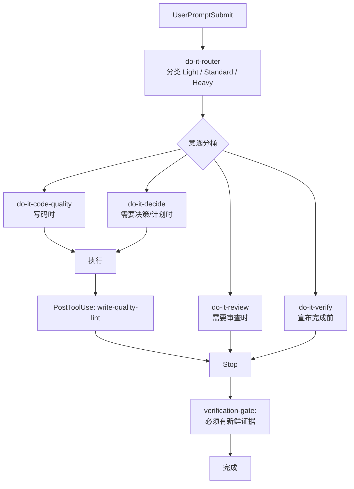

# do-it

[English](./README.md) | [中文](./README.zh-CN.md)

[](https://github.com/tdwhere123/do-it/actions/workflows/ci.yml)
[](https://github.com/tdwhere123/do-it/actions/workflows/codeql.yml)
[](LICENSE)

> 不要再要求 AI agent 记住流程。把流程装进去。

`do-it` 把 AI 编程协作里的工程纪律变成 **Codex**、**Claude Code**、**Cursor**
和 **OpenCode** 可安装的工作流：按风险选择流程、用明确契约委派子智能体、没有
新鲜验证证据不能宣布完成。

这是我自己每天真实使用的工作流，用在实际项目里。如果它适合你的习惯，可以直接
用；如果你觉得哪里不对，欢迎提 issue、发 PR，或者 fork 后改造成自己的 agent
工作流。

## 四件事

### 按风险路由

agent 动手之前，先把任务分成 `Light`、`Standard` 或 `Heavy`，再由 router 点名要加载的**意涵分桶**——不是固定流水线。

- `Light`：小范围本地修改、文档微调、一次性检查。
- `Standard`：普通的非平凡工程任务——只在任务需要时加载对应分桶。
- `Heavy`：发布、架构调整、跨模块策略、公开工作流变化，或多 agent 交付——默认触发 `do-it-decide` 压测。

| 分桶 | Skill | 时机 |
|---|---|---|
| 写码主防线 | `do-it-code-quality` | 改代码时——范围、TDD、调试、契约 |
| 决策 | `do-it-decide` | 选项不清、承重前提、需要 durable plan |
| 审查 | `do-it-review` | 交付 diff 需要审视与修复 |
| 验证 | `do-it-verify` | done / ready / merge 声明之前 |

重点不是增加仪式。小事保持小；Standard 不背强制的 brainstorm → grill → plan → review 链；Heavy 默认拿满 decide 预算。

### 用契约委派

子智能体只有在边界清楚时才真正有用。`do-it` 把委派当成契约问题，而不是调度问题。

每个被委派的 slice 都要锁定：

| 字段 | 锁定的内容 |
|---|---|
| `scope` | 子 agent 拥有的那一个边界明确的产出。 |
| `write ownership` | 子 agent 被允许编辑的路径。 |
| `forbidden paths` | 子 agent 即使能帮上忙也不许碰的路径。 |
| `must-verify facts` | 子 agent 动手之前必须确认的具体声明。 |
| `stop condition` | 触发子 agent 收尾的具体事件。 |
| `return schema` | 它最终回报的结构化形态。 |

不需要外部 orchestrator。父 agent 仍然负责，契约就是普通文本；任何支持 skill
和子 agent 的 host 都能用。

### 用证据收口

`do-it` 把“完成”当成一个需要证据支持的声明。只要改了文件，agent 就需要拿到
新鲜验证输出，才能说任务完成。

这样收口状态绑定的是仓库实际状态，而不是 agent 的自信。

### 让代码尽量少

`do-it` 把每一行代码都先当成负债，再当成资产。一条共享的**决策阶梯**贯穿整个写代码
生命周期：它需不需要存在？→ stdlib 能做吗？→ 平台原生有吗？→ 已装依赖能做吗？→
能一行吗？→ 才轮到最小自建。命中第一个成立的档就停。

它接在三个点上，而不是事后挂一个 linter：

- **写之前**，前提承重时由 `do-it-decide` 做必要性拷问（Heavy 默认触发）。
- **写之中**，`do-it-code-quality` 加上旁路 `write-quality-lint` hook 标出注释
  纪律、粗粒度反模式和 integrity 气味（每文件一条提醒；从不阻塞）。
- **写之后**，`do-it-review` 给出「可删 / 可内联 / 可用 stdlib 替代」的发现，
  并修掉 Blocking / Important。

被砍的永远不是安全：信任边界输入校验、防数据丢失的错误处理、安全、可达性都保留。

## 安装（插件优先）

四个宿主均采用 **插件优先**，但各宿主有 **不同** 的官方安装方式。插件包同时携带 skills、agents 和 hooks。

### Codex

```bash
codex plugin marketplace add tdwhere123/do-it
codex plugin add do-it@tdwhere-do-it
```

`codex plugin marketplace add` 只注册 marketplace，**不会**安装插件。安装后请在 `/hooks` **信任插件 hooks**，以便自动跑路由、Heavy grill 提醒、子 agent 姿态、write-quality lint 和 verification gate。

本地 checkout 冒烟（可用临时 `CODEX_HOME`）：

```bash
CODEX_HOME=/tmp/do-it-plugin-test codex plugin marketplace add /path/to/do-it
CODEX_HOME=/tmp/do-it-plugin-test codex plugin add do-it@tdwhere-do-it
```

Codex plugin bundle 位于 `plugins/do-it/`（由 `manifest.json` 生成）：
8 个 skill、10 个 agent，以及插件内 hooks。

### Claude Code

```text
/plugin marketplace add tdwhere123/do-it
/plugin install do-it@do-it
```

### Cursor

**Cursor 不使用 Claude Code 的 `/plugin …` 斜杠命令。**

Cursor **有**官方公开市场（[cursor.com/marketplace](https://cursor.com/marketplace)），但 **`do-it` 目前尚未上架**。在提交并通过审核前，请用：

1. **本地（今日推荐）：** 将 `plugins/do-it-cursor/` 符号链接或复制到 `~/.cursor/plugins/local/do-it-cursor`，然后 **Developer: Reload Window**。
2. **CLI 镜像：** `do-it setup --target=cursor` 后 Reload。
3. **团队 Import（不必公开上架）：** Dashboard → Plugins → Import from Repo → `https://github.com/tdwhere123/do-it`（读取 `.cursor-plugin/marketplace.json`）。
4. **日后公开上架：** 提交到 [cursor.com/marketplace/publish](https://cursor.com/marketplace/publish)。

Cursor 装 **完整 8 个 skill**（`do-it-router`、`do-it-code-quality`、`do-it-review`、`do-it-decide`、`do-it-verify`，以及 `do-it-handbook`、`do-it-context`、`do-it-skill-authoring`），外加 skills index 与 `references/`——与 Codex、Claude、OpenCode 相同。

中等 hook 深度：`sessionStart`、`beforeSubmitPrompt`（router / Heavy grill / stance）、`postToolUse` / `afterFileEdit` 旁路 `write-quality-lint`、`stop` 验证闸。详见 [`docs/harness-adapter-matrix.md`](./docs/harness-adapter-matrix.md)。

### OpenCode

OpenCode 从 `opencode.json` 的 `"plugin"` 数组加载插件。**当前以本地路径为主：**

```bash
npm run build:opencode-plugin
cd plugins/do-it-opencode && npm install   # 首次或缺依赖时
```

在项目或全局 `opencode.json` 中用绝对路径注册构建后的插件目录（见 [`plugins/do-it-opencode/docs/README.opencode.md`](./plugins/do-it-opencode/docs/README.opencode.md)）。

`@tdwhere/do-it-opencode` 发布到 npm 后，OpenCode 可在启动时从 `"plugin"` 数组自动安装——在此之前请用本地路径。

```bash
npm run test-opencode
```

### 可选 / 遗留：`do-it setup`

CLI setup 仍可用于 doctor、临时 home 冒烟，以及从旧全局安装迁移。**不是**
推荐的首选安装方式。优先走插件 marketplace；setup 只做镜像或迁移——不要同时
启用插件安装与一套仍存活的全局 skill 树。

```bash
npm install -g https://github.com/tdwhere123/do-it/archive/refs/heads/main.tar.gz
do-it setup                  # Codex 遗留全局拷贝
do-it setup --target=claude  # 可选：CLI 镜像 Claude 插件
do-it setup --target=cursor  # 可选：CLI 镜像 Cursor 插件
do-it doctor
```

只有在你明确要替换未标记目标时才设 `DO_IT_FORCE=1`。测试时优先用临时 home
（`CODEX_HOME=…`、`CLAUDE_PLUGIN_ROOT_OVERRIDE=…`、`CURSOR_PLUGIN_ROOT_OVERRIDE=…`）。

## 它会安装什么

Skill 矩阵（`manifest.json` 共 8 个 skill；分层见 `scripts/skill-tiers.mjs`）：

| Host | 安装的 skill |
|---|---|
| Codex / Claude / Cursor / OpenCode | 完整树 — 5 核心 + 3 扩展 |

- 意涵分桶 skill：`do-it-router`、`do-it-code-quality`（写码主防线）、
  `do-it-review`（审查 + 修复）、`do-it-decide`（压测 / 发散 / 计划 / 切片）、
  `do-it-verify`（证据 + 收口），以及扩展的 `do-it-handbook`、`do-it-context`、
  `do-it-skill-authoring`。
- 十个可移植 agent：决策侧 `product-strategist` /
  `architecture-strategist` / `plan-challenger`；写码侧 `code-mapper` /
  `code-quality-cleaner` / `tdd-red-writer`；审查侧 `reviewer` /
  `red-team-reviewer` / `spec-compliance-reviewer`；以及
  `documentation-engineer`。
- 四个宿主的插件内 hooks：router、仅 Heavy 的 `grill-prompt`、
  `subagent-stance`、旁路 `write-quality-lint`、`verification-gate`。
  不再有 `grill-pretool` 计划闸。
- Claude 斜杠命令（`do-it-skip`、`do-it-handbook`），不保留旧工作流命令别名。
- 可选 CLI 安装器 / `doctor`，用于迁移与冒烟。
- 根目录 `index.json`，供外部发现与覆盖检查。

## 整体流程



实际运行时：

1. `do-it-router` 分类任务并点名要加载（或跳过）的意涵分桶。没有强制 skill 链。
2. `do-it-code-quality` 是写码主防线：前提与爆炸半径、注释、深模块、行为变更时的
   TDD、调试、契约。
3. `do-it-decide` 在承重前提时做压测（Heavy 默认）、选项不清时短发散、写最短有用
   计划，仅在工作很大时切片。
4. `do-it-review` 审查交付面并修掉 Blocking / Important。
5. `do-it-verify` 在 done / ready / merge 声明前要求新鲜证据；宿主支持时 Stop hook 会强化该规则，否则只做提醒。

完整策略见 [`docs/routing-matrix.md`](./docs/routing-matrix.md)。

## 不需要你记住的事

- 自动路径不需要背斜杠命令。插件 hooks 会在合适的 host lifecycle 事件上触发。
  Claude 另有可选斜杠命令（`/do-it-skip`、`/do-it-handbook`）；走自动路径时不必
  记住它们。
- 没有外部 orchestration runtime。委派就是父 agent 的明文契约，加上
  `subagent-stance` hook——没有单独的编排 skill。
- 一次性跳过（见 `commands/do-it-skip.md`）。整轮全跳过：`yolo`、
  `just do it`、`直接做`、`我已经想清楚`、`skip do-it`、`随便聊`、`先聊聊`、
  `just thinking`，或 `/do-it-skip`。部分跳过：`skip grill` / `不用 grill`、
  `skip router`、`skip gate`（或 `/do-it-skip grill|router|gate`）。

## 其它安装方式

如果要测试本地打包产物：

```bash
npm pack
npm install -g ./tdwhere-do-it-0.14.0.tgz
do-it setup   # 可选 / 遗留全局拷贝
```

## 本地开发

在仓库 checkout 中，用包入口做 doctor / 迁移冒烟：

```bash
npm exec --package . -- do-it setup
npm exec --package . -- do-it install
npm exec --package . -- do-it doctor
```

也可以使用等价的 package scripts：

```bash
npm run setup
npm run install:do-it
npm run doctor
npm run do-it -- doctor
```

保留的 shell wrapper 用于直接测试安装器，它们委托给同一套受管安装逻辑：

```bash
./install/install.sh
./install/doctor.sh
```

这个包不会通过 npm lifecycle scripts 自动修改 `~/.codex`。只有操作者显式
运行 `do-it setup` 或 `do-it install` 时，才会走可选 CLI 安装。

修改 hook 之前提交 review 前，运行 `npm run lint`（通过 `scripts/lint-hooks.sh`
跑 shellcheck）。`npm test` 会跑 agent schema / generated-inventory 校验、
Cursor / OpenCode 插件构建、hook lint、`scripts/test-hooks.sh` 回归、安装测试
以及 OpenCode 测试。CI 会在 push / PR 上跑 Node 矩阵、生成 agent 检查、
Codex / Claude 安装 smoke test、Cursor 与 OpenCode 插件构建门禁
（`npm run build:cursor-plugin`、`npm run build:opencode-plugin`），以及
package dry run。

## 仓库结构

```text
agents/          可移植的 Codex 智能体 TOML 定义
.agents/plugins/ Codex marketplace 元数据
bin/             全局 do-it CLI 入口
commands/        Claude Code command 入口
dist/claude/     生成后的 Claude Code agent 定义
docs/            路由、维护、来源映射和发布说明
hooks/           Host hook 脚本
index.json       生成后的 skill/agent 发现清单
install/         安装器、doctor 和 shell wrapper 入口
plugins/do-it/          生成后的 Codex plugin bundle
plugins/do-it-cursor/   生成后的 Cursor plugin bundle（核心 skill）
plugins/do-it-opencode/ OpenCode TS 插件与 hook 桥接
skills/custom/   默认不安装的本地 skill 示例
skills/do-it/    会被安装的 do-it 原生 skill 目录
manifest.json    安装清单和目标路径
package.json     npm 包元数据和 CLI scripts
```

私有 `.do-it/` 目录用于本地计划、笔记和临时材料。它被 Git 忽略，也不会被安装。

## 0.14 如何工作（当前）

`0.14` 是以**含义分桶**为主的版本。流程**不是**固定技能流水线。

### 含义分桶（不是仪式链）

| 分桶 | 技能 | 作用 |
|---|---|---|
| 路由 | `do-it-router` | 选 Light / Standard / Heavy；点名要加载或跳过的分桶 |
| 写时 | `do-it-code-quality` | 前提、爆炸半径、深模块、TDD、调试、契约 |
| 决策 | `do-it-decide` | 压测、发散、最短计划、大任务切片 |
| 审查 | `do-it-review` | Standards ∥ Spec 双轴；修 Blocking/Important 后复审 |
| 验证 | `do-it-verify` | done / ready / merge 前要有新鲜证据；分支收尾 |
| 沉淀 | `do-it-handbook`, `do-it-context` | 项目真相与术语（扩展宿主） |
| 元技能 | `do-it-skill-authoring` | 编写 do-it 技能本身 |

**Standard** 按需自选分桶，没有强制的 brainstorm → grill → plan 链。**Heavy**
（或用户明确说 grill）时，`grill-prompt` 才会注入前提压测（走 `do-it-decide`）。

### Hooks（质量，不是演戏）

| Hook | 行为 |
|---|---|
| `router` | 写入 tier + 正交 DIM 信号 |
| `grill-prompt` | **仅 Heavy 或显式 grill** — Standard 保持安静 |
| `subagent-stance` | 给子代理的精简立场提醒 |
| `write-quality-lint` | PostToolUse 劝告（从不阻断） |
| `verification-gate` | Stop **只查证据**：有编辑后的完工话术，需要本回合新鲜的相关 `Bash`/`Shell` 命令（Codex 的 `apply_patch` 算编辑） |

已移除 `grill-pretool`。gate **不**要求 review-loop 标记。

### 安装真相

四宿主均以插件为先。刷新 marketplace 插件（Codex 还需在 `/hooks` 信任），使技能与 hooks 与包一致。可选的 `do-it setup` 只用于 doctor / 迁移 / 临时 HOME 冒烟——**插件与旧版全局拷贝二选一**，不要双装。

Cursor CLI setup 只写 `~/.cursor`（不再写 `~/.claude`）。

### 从 pre-0.14 升级

1. 刷新宿主插件（或可选 `do-it setup` 做旧镜像）。
2. Codex 刷新后在 `/hooks` 信任插件 hooks。
3. 从个人提示/规则中删掉已退役技能名——见 [`CHANGELOG.md`](./CHANGELOG.md) 迁移表。

更早发行说明（0.13.x 及以前）只保留在 `CHANGELOG.md`。不要把其中的历史技能名当成现行规则。

## 站在前人的肩膀上

`do-it` 借用了已经被两个高质量项目验证过的 **plan / subworker / TDD / review**
范式：

- [`obra/superpowers`](https://github.com/obra/superpowers)：skill + subworker
  协作模式。
- [`mattpocock/skills`](https://github.com/mattpocock/skills)：skill 的打包
  与发现机制，以及塑造了 `do-it-decide` 压测与发散模式的提示词收敛术（leading word
  胜过形容词三连、一次一问、可检验的完成判据）。
- [`addyosmani/agent-skills`](https://github.com/addyosmani/agent-skills)：
  production skill 的结构、反合理化和证据优先方法。
- [`DietrichGebert/ponytail`](https://github.com/DietrichGebert/ponytail)：
  「最好的代码是你没写的代码」这条决策阶梯，以及《让代码尽量少》背后的 YAGNI
  复审纪律。

`do-it` 是我自己对同一类问题的解法，来自这些项目给我的启发，也来自我每天在
真实项目里的使用。这里吸收的是方法并改写成 do-it 原生的 Router / Tier /
Skill 语言；不会 vendor 上游 skill 原文，也不会安装上游 skill 名称。

也感谢 [Linux.do](https://linux.do) 社区。那里的讨论持续给我提供了很多实际的
agent 工作流反馈和想法。

## 维护说明

修改 skill、agent、安装器或包元数据时，参考 [docs/maintenance.md](./docs/maintenance.md)。
简要规则如下：

1. 修改仓库中的受维护副本。
2. 安装清单变化时同步更新 `manifest.json`。
3. 路由或收口策略变化时同步更新 `docs/routing-matrix.md`。
4. 用临时 `CODEX_HOME` 验证安装和 doctor。
5. 发布前确认打包产物包含预期文件。

常用发布检查：

```bash
git diff --check
npm test
npm run validate:agents
npm run build:codex-plugin
npm run build:cursor-plugin
CODEX_HOME=/tmp/do-it-plugin-test codex plugin marketplace add /path/to/do-it
CODEX_HOME=/tmp/do-it-plugin-test codex plugin add do-it@tdwhere-do-it
CLAUDE_PLUGIN_ROOT_OVERRIDE=/tmp/do-it-claude-test npm exec --package . -- do-it doctor --target=claude
npm pack --dry-run --json
```

优先做 marketplace / 插件冒烟；可选的 `do-it setup` 只用于遗留 CLI 镜像与迁移。

## 贡献

你可以直接使用 `do-it`，也可以提交聚焦改进，或者 fork 成自己的工作流。这里接受
改动的唯一硬要求是：它来自真实使用。

详见 [CONTRIBUTING.md](./CONTRIBUTING.md)：两条硬规则（先 dogfood、先 Issue）、
例外清单（typo / 翻译 / 可复现 bug fix），以及 PR 模板。
