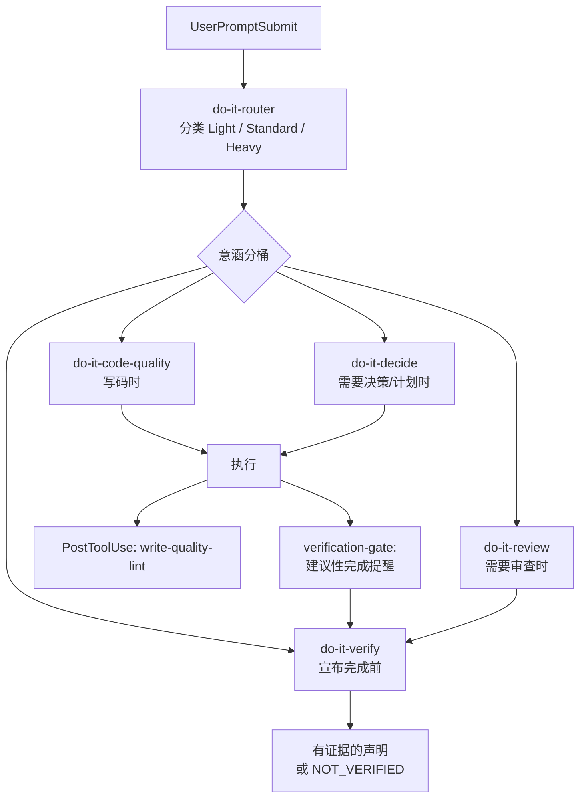

# do-it

[English](./README.md) | [中文](./README.zh-CN.md)

[](https://github.com/tdwhere123/do-it/actions/workflows/ci.yml)
[](https://github.com/tdwhere123/do-it/actions/workflows/codeql.yml)
[](LICENSE)

> 不要再要求 AI agent 记住流程。把流程装进去。

`do-it` 把 AI 编程协作里的工程纪律变成 **Codex**、**Claude Code**、**Cursor**
和 **OpenCode** 可安装的工作流：按风险给出建议、提供可选的子智能体专长，并让
完成声明绑定新鲜、与声明相关的证据。

这是我自己每天真实使用的工作流，用在实际项目里。如果它适合你的习惯，可以直接
用；如果你觉得哪里不对，欢迎提 issue、发 PR，或者 fork 后改造成自己的 agent
工作流。

## 四件事

### 按风险路由

agent 动手之前，router 会给任务一个建议性的 `Light`、`Standard` 或 `Heavy` 标签，
再建议可能有用的**意涵分桶**——不是固定流水线。用户的直接意图和模型对任务的
理解优先于关键词分类。

- `Light`：小范围本地修改、文档微调、一次性检查。
- `Standard`：普通的非平凡工程任务——只在任务需要时加载对应分桶。
- `Heavy`：发布、架构调整、跨模块策略、公开工作流变化，或不可逆收口——仅在会改变路线时压测前提或加载决策能力。

| 分桶 | Skill | 时机 |
|---|---|---|
| 写码主防线 | `do-it-code-quality` | 改代码时——范围、TDD、调试、契约 |
| 决策 | `do-it-decide` | 选项不清、承重前提、需要 durable plan |
| 审查 | `do-it-review` | 交付 diff 需要审视与修复 |
| 验证 | `do-it-verify` | done / ready / merge 声明之前 |

重点不是增加仪式。小事保持小；Standard 不背强制的 brainstorm → grill → plan → review 链；Heavy 只在风险真实存在时增加审视。独立的子 agent 工作在任何 tier 都可以按任务需要使用。

### 自由委派

插件内的子智能体是可选的能力专家，不是流水线。独立的路径图、审查或专业视角能
提高结果时就可使用——尤其是用户直接要求时。给 worker 目标、必要的所有权或副作用
边界，以及有用的结果或证据；只有 slice 确实需要时才补更多上下文。

worker 可以自主检查、返回不确定项；父 agent 负责整合和最终声明。没有必须遵守的
委派合同、固定 agent 数量或角色矩阵。用户自己定义的全局 agent 不属于 do-it 的
插件清单，也不会被插件更新覆盖。

### 用证据收口

`do-it` 把“完成”当成一个需要证据支持的声明。`do-it-verify` 要求从当前工作区
取得新鲜、与声明相关的证明；没有证明时要写 `NOT_VERIFIED` 并说明下一项检查。

`verification-gate` hook 只做提醒，不会按命令白名单判断证据，也不阻断普通本地
工作。这样收口状态绑定的是仓库实际状态，而不是 agent 的自信。

对于外部副作用，do-it 要求 agent 先确认；真正能强制执行这一边界的是宿主的
sandbox、审批策略和命令规则。插件 hook 的提醒始终只是建议，不能替代宿主原生权限。
Claude 另有默认关闭、仅覆盖具名高风险命令的可选 `ask` profile；它不是通用拦截器。
详见[严格外部操作](./docs/strict-external-actions.md)。

### 从行为中学习，但默认不增加噪音

反馈记录器默认关闭。用 `/do-it-retrospective on` 才会开始在当前项目本地、
去敏地记录明确的行为反馈；用 `/do-it-retrospective report` 输出紧凑报告
（有效/跳过事件、重复信号、最多三条候选经验和剩余不确定性）。它不会注入提示词上下文，
会保守地忽略普通工作提示，也不会在之后没有精确确认的情况下写入 `AGENTS.md` 或
`CLAUDE.md`。
在 Git 工作区中，运行态目录通过该 worktree 的本地 exclude 隐藏，不会修改项目的
`.gitignore`。

### 让代码尽量少

`do-it` 把每一行代码都先当成负债，再当成资产。一条共享的**决策阶梯**贯穿整个写代码
生命周期：它需不需要存在？→ stdlib 能做吗？→ 平台原生有吗？→ 已装依赖能做吗？→
能一行吗？→ 才轮到最小自建。命中第一个成立的档就停。

它接在三个点上，而不是事后挂一个 linter：

- **写之前**，只有承重前提确实需要必要性拷问时才使用 `do-it-decide`。
- **写之中**，`do-it-code-quality` 加上旁路 `write-quality-lint` hook 标出注释
  纪律、粗粒度反模式和 integrity 气味（每文件一条提醒；从不阻塞）。
- **写之后**，`do-it-review` 给出「可删 / 可内联 / 可用 stdlib 替代」的发现，
  并修掉 Blocking / Important。

被砍的永远不是安全：信任边界输入校验、防数据丢失的错误处理、安全、可达性都保留。

## 安装（插件优先）

交付方式按宿主区分：Codex 与 Claude Code **marketplace 优先**；Cursor
目前走**本地拷贝或 Team Import，公开上架待完成**；OpenCode 目前走**本地
`opencode.json` 注册，npm 发布待完成**。插件包同时携带 skills、agents 和 hooks。

| 真相平面 | 本仓库可以声明的内容 |
|---|---|
| 源码 / 包元数据 | 当前 checkout 声明 `0.14.0`、9 个用户可运行 skill + 1 个生成式发现入口、10 个 agent。 |
| Git tag | 当前 checkout 没有对应的 `v0.14.0` tag；版本元数据不等于发布 tag。 |
| Marketplace / npm | 文档可以记录坐标与未来发布路径，但元数据本身不能证明已经公开上架或发布到 registry。 |
| Live host | 只有在对应宿主安装并检查，才能证明那里实际启用了什么；不能从源码或 tarball 推断。 |

### Codex

```bash
codex plugin marketplace add tdwhere123/do-it
codex plugin add do-it@tdwhere-do-it
```

`codex plugin marketplace add` 只注册 marketplace，**不会**安装插件。安装后请在 `/hooks` **信任插件 hooks**，以便自动跑路由、Heavy grill 提醒、子 agent 姿态、write-quality lint 和 verification 提醒。

本地 checkout 冒烟（可用临时 `CODEX_HOME`）：

```bash
CODEX_HOME=/tmp/do-it-plugin-test codex plugin marketplace add /path/to/do-it
CODEX_HOME=/tmp/do-it-plugin-test codex plugin add do-it@tdwhere-do-it
```

Codex plugin bundle 位于 `plugins/do-it/`（由 `manifest.json` 生成）：
9 个用户可运行 skill、1 个生成式 `_index.md` 发现入口、10 个 agent，以及插件内 hooks。
现代 Codex 插件拥有这些 do-it agent；`manifest.targets.codex.installAgents=false`
会保留 `~/.codex/agents` 给用户自己定义的 agent。旧版迁移只会移除已确认的 do-it
重复项。

### Claude Code

```text
/plugin marketplace add tdwhere123/do-it
/plugin install do-it@do-it
```

### Cursor

**Cursor 不使用 Claude Code 的 `/plugin …` 斜杠命令。**

Cursor **有**官方公开市场（[cursor.com/marketplace](https://cursor.com/marketplace)），但 **`do-it` 目前尚未上架**。在提交并通过审核前，请用：

1. **本地（今日推荐）：**
   ```bash
   npm run build:cursor-plugin
   node scripts/install-cursor-local.mjs
   ```
   然后 **Developer: Reload Window**。脚本会把插件**真实拷贝**到
   `~/.cursor/plugins/local/do-it-cursor`（Cursor **拒绝**指向 `local/` 外的
   symlink），并**合并** do-it 条目到用户级 `~/.cursor/hooks.json`（当前
   Cursor Hooks UI/服务**不会**注册 plugin 包内 `hooks/hooks.json`）。
   入口一律走 `hooks/run-hook.cmd …`——原生 Windows 上若直接写 `.sh`，Cursor
   会把脚本**当文件打开**而不是执行。**原生 Windows** 目标是
   `%USERPROFILE%\.cursor\plugins\local\do-it-cursor`（绝不会写成
   `/mnt/c/...`）。Windows + WSL 下若能看到 `/mnt/c/Users` 还会镜像到该
   Windows 配置目录。Reload 后确认准确的插件目录存在，且 Customize → Hooks
   能看到用户级 do-it 的 `.cmd` 条目；Agent 触发时不应弹出 `.sh` 源码。这个
   本地拷贝路径不会生成受管 CLI install state，因此普通 `do-it doctor` 不负责
   验证它。
2. **受管 CLI setup：** `do-it setup --target=cursor` 后 Reload（同一
   `…/plugins/local/do-it-cursor` 路径 + 用户 hooks 合并）。`setup` 会先受管安装
   再运行 `doctor`；之后的 `do-it doctor --target=cursor` 仅适用于该受管 CLI
   setup。
3. **团队 Import（不必公开上架）：** Dashboard → Plugins → Import from Repo → `https://github.com/tdwhere123/do-it`（读取 `.cursor-plugin/marketplace.json`）。
4. **日后公开上架：** 提交到 [cursor.com/marketplace/publish](https://cursor.com/marketplace/publish)。

Cursor 装 **完整 9 个 skill**（`do-it-router`、`do-it-code-quality`、`do-it-review`、`do-it-decide`、`do-it-verify`，以及 `do-it-handbook`、`do-it-context`、`do-it-skill-authoring`、`do-it-retrospective`），外加 skills index 与 `references/`——与 Codex、Claude、OpenCode 相同。

中等 hook 深度：`sessionStart`、`beforeSubmitPrompt`（router / Heavy grill / stance）、`postToolUse` / `afterFileEdit` 旁路 `write-quality-lint`、`stop` 建议性验证提醒。详见 [`docs/harness-adapter-matrix.md`](./docs/harness-adapter-matrix.md)。

### OpenCode

OpenCode 从 `opencode.json` 的 `"plugin"` 数组加载插件。**当前以全局 vendor
安装为主**（不要把日常宿主指到 git checkout）：

```bash
npm run install:opencode-global
```

会构建插件、拷到 `~/.config/opencode/vendor/do-it-opencode`，并在全局配置里注册
`@tdwhere/do-it-opencode`（详见
[`plugins/do-it-opencode/docs/README.opencode.md`](./plugins/do-it-opencode/docs/README.opencode.md)）。
安装后重启 OpenCode。

`@tdwhere/do-it-opencode` 发布到 npm 后，优先用
`opencode plugin @tdwhere/do-it-opencode -g`（或在 `"plugin"` 里写包名）。
仓库绝对路径仅作 **开发调试**。

```bash
npm run test-opencode
```

### 可选 / 遗留：`do-it setup`

CLI setup 仍可用于 doctor、临时 home 冒烟，以及从旧全局安装迁移。**不是**
推荐的首选安装方式。优先走插件 marketplace；setup 只做镜像或迁移——不要同时
启用插件安装与一套仍存活的、受 do-it 管理的遗留全局镜像。用户自己定义的全局
agent 可以独立保留。

```bash
npm install -g https://github.com/tdwhere123/do-it/archive/refs/heads/main.tar.gz
do-it setup                  # Codex 遗留全局拷贝
do-it setup --target=claude  # 可选：CLI 镜像 Claude 插件
do-it setup --target=cursor  # 可选：CLI 镜像 Cursor 插件
do-it doctor
```

只有在你明确要替换未标记目标时才设 `DO_IT_FORCE=1`。测试时优先用临时 home
（`CODEX_HOME=…`、`CLAUDE_PLUGIN_ROOT_OVERRIDE=…`、`CURSOR_PLUGIN_ROOT_OVERRIDE=…`）。

## 它会安装什么

可运行 skill 矩阵（分层见 `scripts/skill-tiers.mjs`）：

| Host | 用户可运行 skill | 发现元数据 | Agent |
|---|---|---|---|
| Codex / Claude / Cursor / OpenCode | 9 个 — 5 核心 + 4 扩展 | 1 个生成式 `_index.md` 入口（不是第十个 skill） | 10 个 |

- 意涵分桶 skill：`do-it-router`、`do-it-code-quality`（写码主防线）、
  `do-it-review`（审查 + 修复）、`do-it-decide`（压测 / 发散 / 计划 / 切片）、
  `do-it-verify`（证据 + 收口），以及扩展的 `do-it-handbook`、`do-it-context`、
  `do-it-skill-authoring`，以及按需的 `do-it-retrospective`。
- 十个可移植 agent：决策侧 `product-strategist` /
  `architecture-strategist` / `plan-challenger`；写码侧 `code-mapper` /
  `code-quality-cleaner` / `tdd-red-writer`；审查侧 `reviewer` /
  `red-team-reviewer` / `spec-compliance-reviewer`；以及
  `documentation-engineer`。
- 四个宿主的插件内 hooks：默认关闭、静默的 `behavior-feedback`；router、仅 Heavy 的 `grill-prompt`、
  `subagent-stance`、旁路 `write-quality-lint`、`verification-gate`。
  verification hook 在所有宿主都只做建议性提醒；`do-it-verify` 仍负责声明级的
  证明。任何宿主都不再注册 `grill-pretool` 计划闸。
- Claude 斜杠命令（`do-it-skip`、`do-it-handbook`、`do-it-retrospective`），不保留旧工作流命令别名。
- 可选 CLI 安装器 / `doctor`，用于迁移与冒烟。
- 根目录 `index.json`，供外部发现与覆盖检查。

如需卸载，请按[安全清理 runbook](./docs/maintenance.md#safe-cleanup-runbook) 逐宿主、
逐准确路径清理并保留无关插件与 hook；不要为了移除 do-it 递归删除整个宿主配置目录。

## 整体流程



实际运行时：

1. `do-it-router` 给出建议性的风险标签和可能有用的意涵分桶。用户直接意图和模型
   判断优先；没有强制 skill 链。
2. `do-it-code-quality` 是写码主防线：前提与爆炸半径、注释、深模块、行为变更时的
   TDD、调试、契约。
3. `do-it-decide` 在承重前提时做压测（Heavy 默认）、选项不清时短发散、写最短有用
   计划，仅在工作很大时切片。
4. `do-it-review` 审查交付面并修掉 Blocking / Important。
5. `do-it-verify` 在 done / ready / merge 声明前要求新鲜、与声明相关的证据；宿主
   hook 只做提醒，不能替代这一判断。

完整策略见 [`docs/routing-matrix.md`](./docs/routing-matrix.md)。

## 不需要你记住的事

- 自动路径不需要背斜杠命令。插件 hooks 会在合适的 host lifecycle 事件上触发。
  Claude 另有可选斜杠命令（`/do-it-skip`、`/do-it-handbook`、
  `/do-it-retrospective on|off|status|report`）；走自动路径时不必记住它们。
- 没有外部 orchestration runtime。插件内 agent 是可选能力专家；父 agent 给出
  有用的目标和边界上下文后负责整合，没有单独的编排 skill。
- 一次性跳过（见 `commands/do-it-skip.md`）。整轮全跳过：`yolo`、
  `just do it`、`直接做`、`我已经想清楚`、`skip do-it`、`随便聊`、`先聊聊`、
  `just thinking`，或 `/do-it-skip`。部分跳过：`skip grill` / `不用 grill`、
  `skip router`、`skip gate`（或 `/do-it-skip grill|router|gate`）。

## 其它安装方式

如果要测试本地打包产物：

```bash
npm pack
npm install -g ./tdwhere-do-it-0.14.0.tgz
do-it setup   # 可选 / 遗留全局拷贝
```

## 本地开发

在仓库 checkout 中，用包入口做 doctor / 迁移冒烟：

```bash
npm exec --package . -- do-it setup
npm exec --package . -- do-it install
npm exec --package . -- do-it doctor
```

也可以使用等价的 package scripts：

```bash
npm run setup
npm run install:do-it
npm run doctor
npm run do-it -- doctor
```

保留的 shell wrapper 用于直接测试安装器，它们委托给同一套受管安装逻辑：

```bash
./install/install.sh
./install/doctor.sh
```

这个包不会通过 npm lifecycle scripts 自动修改 `~/.codex`。只有操作者显式
运行 `do-it setup` 或 `do-it install` 时，才会走可选 CLI 安装。

修改 hook 之前提交 review 前，运行 `npm run lint`（通过 `scripts/lint-hooks.sh`
跑 shellcheck）。`npm test` 会跑 agent schema / generated-inventory 校验、
Cursor / OpenCode 插件构建、hook lint、`scripts/test-hooks.sh` 回归、安装测试
以及 OpenCode 测试。CI 会在 push / PR 上跑 Node 矩阵、生成 agent 检查、
Codex / Claude 安装 smoke test、Cursor 与 OpenCode 插件构建门禁
（`npm run build:cursor-plugin`、`npm run build:opencode-plugin`），以及
package dry run。

## 仓库结构

```text
agents/          可移植的 Codex 智能体 TOML 定义
.agents/plugins/ Codex marketplace 元数据
bin/             全局 do-it CLI 入口
commands/        Claude Code command 入口
dist/claude/     生成后的 Claude Code agent 定义
docs/            路由、维护、来源映射和发布说明
hooks/           Host hook 脚本
index.json       生成后的 skill/agent 发现清单
install/         安装器、doctor 和 shell wrapper 入口
plugins/do-it/          生成后的 Codex plugin bundle
plugins/do-it-cursor/   生成后的 Cursor plugin bundle（完整 9 个 skill）
plugins/do-it-opencode/ OpenCode TS 插件与 hook 桥接
skills/custom/   默认不安装的本地 skill 示例
skills/do-it/    会被安装的 do-it 原生 skill 目录
manifest.json    安装清单和目标路径
package.json     npm 包元数据和 CLI scripts
```

私有 `.do-it/` 目录用于本地计划、笔记和临时材料。它被 Git 忽略，也不会被安装。

## 0.14 如何工作（当前）

`0.14` 是以**含义分桶**为主的版本。流程**不是**固定技能流水线。

### 含义分桶（不是仪式链）

| 分桶 | 技能 | 作用 |
|---|---|---|
| 路由 | `do-it-router` | 选 Light / Standard / Heavy；点名要加载或跳过的分桶 |
| 写时 | `do-it-code-quality` | 前提、爆炸半径、深模块、TDD、调试、契约 |
| 决策 | `do-it-decide` | 压测、发散、最短计划、大任务切片 |
| 审查 | `do-it-review` | Standards ∥ Spec 双轴；修 Blocking/Important 后复审 |
| 验证 | `do-it-verify` | done / ready / merge 前要有新鲜证据；分支收尾 |
| 沉淀 | `do-it-handbook`, `do-it-context` | 项目真相与术语（扩展宿主） |
| 元技能 | `do-it-skill-authoring` | 编写 do-it 技能本身 |
| 复盘 | `do-it-retrospective` | 默认关闭的去敏本地行为报告；只有确认后才建议沉淀经验 |

**Standard** 按需自选分桶，没有强制的 brainstorm → grill → plan 链。**Heavy**
（或用户明确说 grill）时，`grill-prompt` 才会注入前提压测（走 `do-it-decide`）。

### Hooks（质量，不是演戏）

| Hook | 行为 |
|---|---|
| `behavior-feedback` | 默认关闭；只静默记录去敏后的明确行为反馈，供用户手动出报告 |
| `router` | 写入建议性 tier + 正交 DIM 信号；用户直接意图优先 |
| `grill-prompt` | **仅 Heavy 或显式 grill** — Standard 保持安静 |
| `subagent-stance` | 给子代理的精简立场提醒 |
| `write-quality-lint` | PostToolUse 劝告（从不阻断） |
| `verification-gate` | 对编辑后的完成声明给出建议性 Stop 提醒；不按命令名推断证据 |

已移除 `grill-pretool`。声明是否诚实由 `do-it-verify` 的任务相关证据决定，不由
hook 决定。

### 安装真相

Codex 与 Claude marketplace 优先；Cursor 在公开上架前使用本地拷贝 / Team Import；OpenCode 在确认 npm 发布前使用本地 `opencode.json` 注册。可选的 `do-it setup` 只用于受管 CLI doctor / 迁移 / 临时 HOME 冒烟——宿主插件安装与旧版/受管拷贝二选一，不要双装。

Cursor CLI setup 只写 `~/.cursor`（不再写 `~/.claude`）。

### 从 pre-0.14 升级

1. 刷新宿主插件（或可选 `do-it setup` 做旧镜像）。
2. Codex 刷新后在 `/hooks` 信任插件 hooks。
3. 从个人提示/规则中删掉已退役技能名——见 [`CHANGELOG.md`](./CHANGELOG.md) 迁移表。

更早发行说明（0.13.x 及以前）只保留在 `CHANGELOG.md`。不要把其中的历史技能名当成现行规则。

## 站在前人的肩膀上

`do-it` 借用了已经被两个高质量项目验证过的 **plan / subworker / TDD / review**
范式：

- [`obra/superpowers`](https://github.com/obra/superpowers)：skill + subworker
  协作模式。
- [`mattpocock/skills`](https://github.com/mattpocock/skills)：skill 的打包
  与发现机制，以及塑造了 `do-it-decide` 压测与发散模式的提示词收敛术（leading word
  胜过形容词三连、一次一问、可检验的完成判据）。
- [`addyosmani/agent-skills`](https://github.com/addyosmani/agent-skills)：
  production skill 的结构、反合理化和证据优先方法。
- [`DietrichGebert/ponytail`](https://github.com/DietrichGebert/ponytail)：
  「最好的代码是你没写的代码」这条决策阶梯，以及《让代码尽量少》背后的 YAGNI
  复审纪律。

`do-it` 是我自己对同一类问题的解法，来自这些项目给我的启发，也来自我每天在
真实项目里的使用。这里吸收的是方法并改写成 do-it 原生的 Router / Tier /
Skill 语言；不会 vendor 上游 skill 原文，也不会安装上游 skill 名称。

也感谢 [Linux.do](https://linux.do) 社区。那里的讨论持续给我提供了很多实际的
agent 工作流反馈和想法。

## 维护说明

修改 skill、agent、安装器或包元数据时，参考 [docs/maintenance.md](./docs/maintenance.md)。
简要规则如下：

1. 修改仓库中的受维护副本。
2. 安装清单变化时同步更新 `manifest.json`。
3. 路由或收口策略变化时同步更新 `docs/routing-matrix.md`。
4. 用临时 `CODEX_HOME` 验证安装和 doctor。
5. 发布前确认打包产物包含预期文件。

常用发布检查：

```bash
git diff --check
npm test
npm run validate:agents
npm run build:codex-plugin
npm run build:cursor-plugin
CODEX_HOME=/tmp/do-it-plugin-test codex plugin marketplace add /path/to/do-it
CODEX_HOME=/tmp/do-it-plugin-test codex plugin add do-it@tdwhere-do-it
CLAUDE_PLUGIN_ROOT_OVERRIDE=/tmp/do-it-claude-test npm exec --package . -- do-it doctor --target=claude
npm run validate:release -- vX.Y.Z
npm run smoke:package
```

优先做 marketplace / 插件冒烟；可选的 `do-it setup` 只用于遗留 CLI 镜像与迁移。

## 贡献

你可以直接使用 `do-it`，也可以提交聚焦改进，或者 fork 成自己的工作流。这里接受
改动的唯一硬要求是：它来自真实使用。

详见 [CONTRIBUTING.md](./CONTRIBUTING.md)：两条硬规则（先 dogfood、先 Issue）、
例外清单（typo / 翻译 / 可复现 bug fix），以及 PR 模板。
