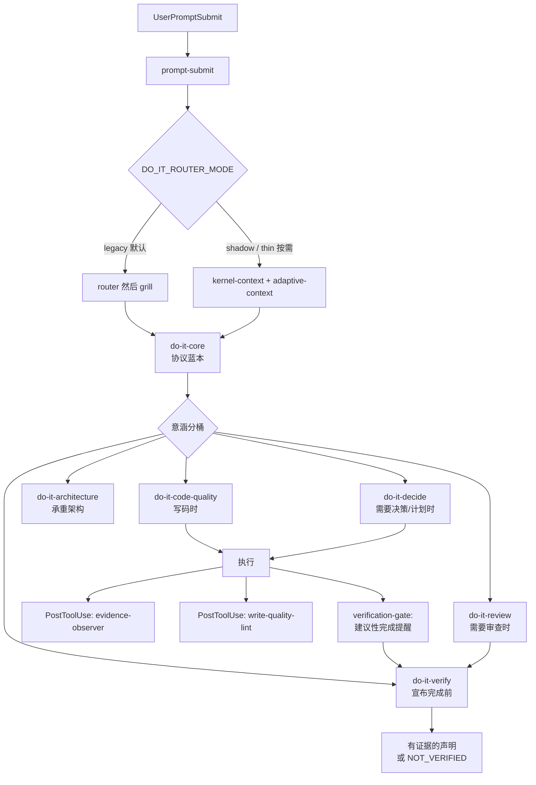

# do-it

[English](./README.md) | [中文](./README.zh-CN.md)

[](https://github.com/tdwhere123/do-it/actions/workflows/ci.yml)
[](https://github.com/tdwhere123/do-it/actions/workflows/codeql.yml)
[](LICENSE)

> 少即是多。最好的工作流，是你感觉不到它——直到它救了你。

**do-it 让 agent 的工作带着证据。** 每一次完成声明都要能追溯到目标、已决决策、
边界、验收，以及当前工作区上的新鲜证据。

大多数 AI 编程工作流在给 agent 加规则。`do-it` 从相反方向出发：
**什么可以不做？** 小事保持小。没有强制的 brainstorm → grill → plan → review
链。每一个 skill、每一个子智能体、每一个 hook，都要靠"此刻有用"来赢得存在——
而不是因为它是流水线的一环。自主优先：用户的直接意图压过 hook 标签。

留下的东西精简而有意：

- **每一行代码，先是负债，后才是资产。** 共享的决策阶梯先问"它需要存在吗"，
  再问"怎么写"。
- **"完成"是证据声明，不是信心等级。** 从工作区拿证据，或者说 `NOT_VERIFIED`。
- **只建议，从不阻塞。** Hook 提醒。Skill 建议。agent 的判断——和你的——赢。

这是我自己每天在真实项目里用的工作流。适合你就用，觉得哪里不对就提 issue、
发 PR，或者 fork 它。

## 快速上手

### 1. 安装

| 宿主 | 命令 |
| --- | --- |
| Codex | `codex plugin marketplace add tdwhere123/do-it && codex plugin add do-it@tdwhere-do-it` |
| Claude Code | `/plugin marketplace add tdwhere123/do-it` → `/plugin install do-it@do-it` |
| Cursor | `npm run install:cursor-local` → Reload Window |
| OpenCode | `opencode plugin @tdwhere/do-it-opencode -g` |
| Pi | `pi install npm:@tdwhere/do-it-pi` |
| Kimi Code | `/plugins install https://github.com/tdwhere123/do-it` |

各宿主详细步骤与冒烟测试见 [docs/install.zh-CN.md](./docs/install.zh-CN.md)。

### 2. 正常对话就行

do-it 在幕后工作，你不需要调用它——它在合适的生命周期点自动触发：

- **默认运行时仍是 legacy**（`DO_IT_ROUTER_MODE=legacy`）：沿用 0.16 的 router
  定级 Light / Standard / Heavy，Heavy 时可能 grill。`shadow` 和 `thin` 改为注入
  精简 kernel 和可选 adaptive overlay；它们是按需开启，不是默认。
- **写码时**，`write-quality-lint` 标出新代码中的反模式。每文件一条提醒；从不
  阻塞。`evidence-observer` 记录编辑和命令事实；命令名本身不是证明。
- **说"完成"之前**，verification gate 要求从当前工作区拿出新鲜证据。

### 3. 建立 `.do-it/`（推荐）

一个小目录，给 agent 跨会话的记忆——项目规则、词汇表、工作笔记。运行：

```
/do-it-handbook init
```

这会创建：

```
.do-it/
  handbook/            稳定的项目真相
    invariants.md        总是优先的规则
    architecture.md      稳定的系统形状
    glossary.md          长期稳定的词汇表
  worklog/             日报或目标笔记
  CONTEXT.md           精炼的术语和关系（自动更新）
  plans/               挣来的执行合同（不是进度日志）
```

把 `invariants.md` 和 `glossary.md` 里的占位符换成你项目的真实规则。其余部分
自行维护。Bootstrap **不会**创建 `brainstorm/` 或 `grill/`。Adaptive profile 和
运行时事件日志放在 gitignored 的 `.do-it/runtime/`（默认关闭；不要把密钥或项目
事实写进去）。

### 4. 想跳就跳

`yolo`、`just do it`、`直接做`、`skip do-it` 或 `/do-it-skip` — 整轮跳过。
`skip grill`、`skip router`、`skip gate` — 部分跳过。

## 它怎么工作

### 合适的体量

Router 给每个任务一个建议性的风险标签——不是权限门。

| 分级 | 发生什么 |
| --- | --- |
| **Light** | 检查 → 做 → 验证。没有额外仪式。 |
| **Standard** | 按需加载 skill。没有强制链。 |
| **Heavy** | 跨边界、发布、安全、不可逆。值得多看一眼。 |

Skill 按需加载，不按分级：

| Skill | 时机 |
| --- | --- |
| `do-it-core` | 常驻协议蓝本——先定分级，再证据 / 范围 / 验证 / 汇报 |
| `do-it-code-quality` | 改代码——范围、TDD、调试、契约 |
| `do-it-architecture` | 承重架构——权威、契约、边界、切换、防护 |
| `do-it-decide` | 选项不清、承重前提 |
| `do-it-review` | diff 需要审视和修复 |
| `do-it-verify` | done / ready / merge 声明之前 |
| `do-it-handbook`, `do-it-context` | 项目真相与词汇表 |
| `do-it-skill-authoring` | 编写 do-it skill |
| `do-it-retrospective` | 默认关闭的行为报告 |
| `do-it-adaptive` | 按需个人 overlay（默认关闭；从不削弱 Core） |

### 更少的代码，不是更多

一条决策阶梯贯穿整个写代码过程：

> 它需要存在吗？→ stdlib 能做？→ 平台原生？→ 已有依赖？→ 一行？→ 才轮到自建。

这不是事后挂的 linter——它接在三个点上：

- **写之前**：`do-it-decide` 问必要性。
- **写之中**：`do-it-code-quality` + `write-quality-lint` 标出应该更简单的
  东西。（[Family 目录](./skills/do-it/references/write-quality-families.md)。）
- **写之后**：`do-it-review` 指出可删、可内联、可用 stdlib 替代的。

被砍的永远不是安全。

### 用证据说话

`do-it` 把"完成"当成证据声明。`do-it-core` § Verify（`do-it-verify` 作为清单）
要求从当前工作区取得新鲜、与声明相关的证明。拿不出证据，诚实的回答就是
`NOT_VERIFIED` 加下一项检查。

对于外部副作用（git push、npm publish …），do-it 要求 agent 先确认。
真正的强制只有宿主的 sandbox 能做。
详见[严格外部操作](./docs/strict-external-actions.md)。

> 提示：描述目标、成功标准和相关约束，然后让 agent 自己规划步骤。

### 需要时委派

十个内置子智能体提供独立的代码地图、审查和专业视角。默认调度是 **0**。最多
**一次**全新上下文的二次查看，且仅当独立证据可能改变昂贵决策、切片足够窄，
或当前上下文已经绑死、无法自审时才用。你自己的全局 agent 不受插件更新影响。

## 整体流程


```mermaid
flowchart TD
    P[UserPromptSubmit] --> PS[prompt-submit]
    PS --> M{DO_IT_ROUTER_MODE}
    M -->|legacy 默认| R[router 然后 grill]
    M -->|shadow / thin 按需| K[kernel-context + adaptive-context]
    R --> C[do-it-core<br/>协议蓝本]
    K --> C
    C --> B{意涵分桶}
    B --> CQ[do-it-code-quality<br/>写码时]
    B --> A[do-it-architecture<br/>承重架构]
    B --> D[do-it-decide<br/>需要决策/计划时]
    B --> RV[do-it-review<br/>需要审查时]
    B --> VY[do-it-verify<br/>宣布完成前]
    CQ --> E[执行]
    D --> E
    E --> EO[PostToolUse: evidence-observer]
    E --> WQ[PostToolUse: write-quality-lint]
    E --> VG[verification-gate:<br/>建议性完成提醒]
    VG --> VY
    RV --> VY
    VY --> Done[有证据的声明<br/>或 NOT_VERIFIED]
```

完整策略见 [`docs/routing-matrix.md`](./docs/routing-matrix.md)。

## 项目级覆盖

项目级覆盖放在 `.do-it/` 下，均为**纯数据**——hook 逐行读取，从不 source
项目文件：

- `keywords.local.tsv`（会话 cwd）扩展 router 关键词表。
- `write-quality.local.tsv`（被编辑文件的 git 根目录）调整数值型限制，例如
  `file-size` 的 warn/split 阈值；环境变量 `DO_IT_FILE_SIZE_WARN_LINES` /
  `DO_IT_FILE_SIZE_SPLIT_LINES` 优先级高于该文件。

Family 目录与抑制语法见
[`skills/do-it/references/write-quality-families.md`](./skills/do-it/references/write-quality-families.md)。

## 发布说明

已发布主线仍是 **0.16.x**。未发布的 0.17 工作（skill、合同、eval、运行时观察）
写在 [`CHANGELOG.md`](./CHANGELOG.md)；默认运行时在打 0.17 标签之前保持
legacy。Tag 策略见 [`docs/release.md`](./docs/release.md)。

## 本地开发

```bash
npm run setup            # 可选 CLI 安装
npm run doctor           # 验证安装
npm run lint             # shellcheck hooks
npm test                 # 完整门禁：构建 + 校验 + 全部测试
```

Shell wrapper（`./install/install.sh`、`./install/doctor.sh`）委托给同一套
受管安装逻辑。这个包不会通过 npm lifecycle scripts 自动修改 `~/.codex`。

## 仓库结构

```text
skills/do-it/    会被安装的 skill 目录（权威来源）
agents/          可移植的 agent TOML 定义
hooks/           Host hook 脚本与数据表
commands/        斜杠命令（Claude / Kimi）
plugins/         各宿主的生成式插件包（Codex、Cursor、OpenCode、Pi）
install/         安装器、doctor、shell wrapper
scripts/         构建、校验、冒烟脚本
tests/           hook、安装、发布、适配器测试
docs/            路由、维护、发布、适配器
```

## 站在前人的肩膀上

`do-it` 借用了
[`mattpocock/skills`](https://github.com/mattpocock/skills)、
[`addyosmani/agent-skills`](https://github.com/addyosmani/agent-skills) 和
[`gsd-build/get-shit-done`](https://github.com/gsd-build/get-shit-done)
的 **plan / subworker / TDD / review** 范式。
逐条对照见 [`docs/upstream-map.md`](./docs/upstream-map.md)。
来源项目不证明 do-it 有效；吸收项仍要在本仓库的行为 eval 里验证。

`do-it` 是我自己对同一类问题的解法，来自真实项目里的日常使用。这里吸收的是
方法，并改写成 do-it 原生的 Router / Tier / Skill 语言；不会 vendor 上游
skill 原文，也不会安装上游 skill 名称。

感谢 [Linux.do](https://linux.do) 社区持续的实战反馈。

## 维护

[docs/maintenance.md](./docs/maintenance.md) 覆盖 skill、agent、安装器和包元数据
的修改规则。

## 贡献

只接受来自真实使用的改动。详见 [CONTRIBUTING.md](./CONTRIBUTING.md)。
