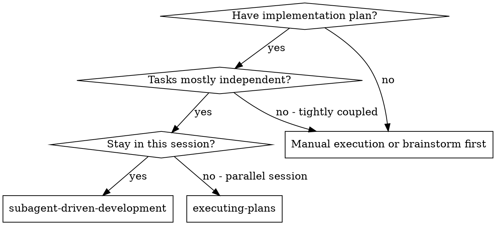
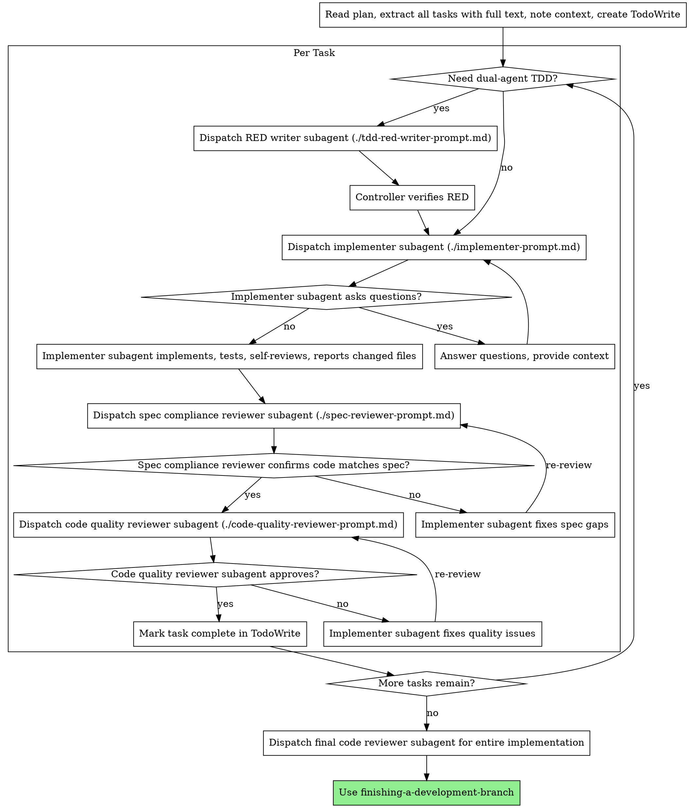

# Subagent-Driven Development

Execute plan by dispatching fresh subagent per task, with explicit routing for single-agent TDD vs dual-agent TDD and with review gates after each task.

**Why subagents:** You delegate tasks to specialized agents with isolated context. By precisely crafting their instructions and context, you ensure they stay focused and succeed at their task. They should never inherit your session's context or history — you construct exactly what they need. This also preserves your own context for coordination work.

**Core principle:** Fresh subagent per task + explicit RED/GREEN routing + spec compliance review + quality review = high quality, fast iteration. The controller owns integration and commit policy.

## Codex Quality Defaults

Before dispatching an implementation subagent for a non-trivial task, get a modification map. Use `code-mapper` when available. The controller should know the owning files, call path, side-effect boundaries, tests to change first, and risky branch points before any worker edits files.

When subagents are permitted, do not skip the mapper for non-trivial work unless
the controller has just read the owning path and can name the exact files,
symbols, risks, and tests without guessing.

Use the existing specialist agents where they fit:

- `code-mapper`: read-only path and ownership mapping before edits
- `tdd-red-writer`: RED-only test authoring when contract locking should be separated from implementation
- `test-automator`: regression coverage or test harness work
- `typescript-pro`: type/API/package-contract work
- `react-specialist`: React UI, hooks, rendering, state flow
- `sql-pro`: SQL, migrations, storage/query behavior
- `architect-reviewer`: architecture boundaries and coupling
- `spec-compliance-reviewer`: task/plan conformance and scope control
- `code-quality-cleaner`: redundancy, low-quality code, dead paths, maintainability
- `red-team-reviewer`: adversarial review for risky state/security/failure modes

For your current quality preference, non-trivial tasks should get `code-quality-cleaner` before completion. Add `red-team-reviewer` only when the risk profile justifies it.

Do not parallelize implementation agents unless write scopes are disjoint. Review agents may run in parallel when they are read-only and their lenses are independent.

Do not let implementation agents create commits by default. They should edit,
test, self-review, and report changed files. The controller creates commits only
after verification and repository-specific commit-message/body rules are known.

## Routing Before Execution

Choose the execution mode per task before dispatch:

- **Single-agent TDD**: default for ordinary non-trivial work
- **Dual-agent TDD**: use when the task crosses multiple files or boundaries,
  the bug root cause is unclear, contracts are changing, or test harness work is
  substantial

If the task came from a `wave` or `phase` plan, also choose the minimum review
stack before work begins:

- `wave`: at least `reviewer + code-quality-cleaner`
- `phase`: `reviewer + code-quality-cleaner + architect-reviewer + one domain/risk reviewer`

## When to Use



**vs. Executing Plans (parallel session):**
- Same session (no context switch)
- Fresh subagent per task (no context pollution)
- Review checkpoints after each task: spec compliance first, then quality
- Faster iteration (no human-in-loop between tasks)

## The Process

Route each task first:

- if **single-agent TDD**, the implementer owns RED and GREEN
- if **dual-agent TDD**, insert `tdd-red-writer` before the implementer and
  make the controller verify RED before handing off GREEN



## Model Selection

Use the least powerful model that can handle each role to conserve cost and increase speed.

**Mechanical implementation tasks** (isolated functions, clear specs, 1-2 files): use a fast, cheap model. Most implementation tasks are mechanical when the plan is well-specified.

**Integration and judgment tasks** (multi-file coordination, pattern matching, debugging): use a standard model.

**Architecture, design, and review tasks**: use the most capable available model.

**Task complexity signals:**
- Touches 1-2 files with a complete spec → cheap model
- Touches multiple files with integration concerns → standard model
- Requires design judgment or broad codebase understanding → most capable model

## Handling Implementer Status

Implementer subagents report one of four statuses. Handle each appropriately:

**DONE:** Proceed to spec compliance review.

**DONE_WITH_CONCERNS:** The implementer completed the work but flagged doubts. Read the concerns before proceeding. If the concerns are about correctness or scope, address them before review. If they're observations (e.g., "this file is getting large"), note them and proceed to review.

**NEEDS_CONTEXT:** The implementer needs information that wasn't provided. Provide the missing context and re-dispatch.

**BLOCKED:** The implementer cannot complete the task. Assess the blocker:
1. If it's a context problem, provide more context and re-dispatch with the same model
2. If the task requires more reasoning, re-dispatch with a more capable model
3. If the task is too large, break it into smaller pieces
4. If the plan itself is wrong, escalate to the human

**Never** ignore an escalation or force the same model to retry without changes. If the implementer said it's stuck, something needs to change.

## Prompt Templates

- `./implementer-prompt.md` - Dispatch implementer subagent
- `./tdd-red-writer-prompt.md` - Dispatch RED-only test writer subagent
- `./spec-reviewer-prompt.md` - Dispatch spec compliance reviewer subagent
- `./code-quality-reviewer-prompt.md` - Dispatch code quality reviewer subagent

## Example Workflow

```
You: I'm using Subagent-Driven Development to execute this plan.

[Read plan file once: docs/superpowers/plans/feature-plan.md]
[Extract all 5 tasks with full text and context]
[Create TodoWrite with all tasks]

Task 1: Hook installation script

[Route: dual-agent TDD because install behavior spans files and contract edge cases]

[Get Task 1 text and context (already extracted)]
[Dispatch RED writer with full task text + context]

RED writer:
  - Added failing tests for user-level install and --force behavior
  - Verified RED on the narrow command

[Controller verifies RED]
[Get Task 1 text and context (already extracted)]
[Dispatch implementation subagent with full task text + context]

Implementer: "Before I begin - should the hook be installed at user or system level?"

You: "User level (~/.config/superpowers/hooks/)"

Implementer: "Got it. Implementing now..."
[Later] Implementer:
  - Implemented install-hook command
  - Added tests, 5/5 passing
  - Self-review: Found I missed --force flag, added it
  - Files changed: install.ts, install.test.ts

[Dispatch spec compliance reviewer]
Spec reviewer: ✅ Spec compliant - all requirements met, nothing extra

[Get git SHAs, dispatch code quality reviewer]
Code reviewer: Strengths: Good test coverage, clean. Issues: None. Approved.

[Mark Task 1 complete]

Task 2: Recovery modes

[Route: single-agent TDD because the task is bounded]

[Get Task 2 text and context (already extracted)]
[Dispatch implementation subagent with full task text + context]

Implementer: [No questions, proceeds]
Implementer:
  - Added verify/repair modes
  - 8/8 tests passing
  - Self-review: All good
  - Files changed: verify.ts, verify.test.ts

[Dispatch spec compliance reviewer]
Spec reviewer: ❌ Issues:
  - Missing: Progress reporting (spec says "report every 100 items")
  - Extra: Added --json flag (not requested)

[Implementer fixes issues]
Implementer: Removed --json flag, added progress reporting

[Spec reviewer reviews again]
Spec reviewer: ✅ Spec compliant now

[Dispatch code quality reviewer]
Code reviewer: Strengths: Solid. Issues (Important): Magic number (100)

[Implementer fixes]
Implementer: Extracted PROGRESS_INTERVAL constant

[Code reviewer reviews again]
Code reviewer: ✅ Approved

[Mark Task 2 complete]

...

[After all tasks]
[Dispatch final review stack sized to task class]
Final reviewers: All requirements met, ready to merge

Done!
```

## Advantages

**vs. Manual execution:**
- Subagents follow TDD naturally
- Fresh context per task (no confusion)
- Parallel-safe (subagents don't interfere)
- Subagent can ask questions (before AND during work)

**vs. Executing Plans:**
- Same session (no handoff)
- Continuous progress (no waiting)
- Review checkpoints automatic

**Efficiency gains:**
- No file reading overhead (controller provides full text)
- Controller curates exactly what context is needed
- Subagent gets complete information upfront
- Questions surfaced before work begins (not after)

**Quality gates:**
- Self-review catches issues before handoff
- Spec compliance review prevents over/under-building
- Code quality review checks maintainability, duplication, and weak tests
- Review loops ensure fixes actually work
- Dual-agent TDD lets RED lock the contract before GREEN when risk justifies it

**Cost:**
- More subagent invocations (implementer + 2 reviewers per task)
- Dual-agent TDD adds one more subagent on selected tasks
- Controller does more prep work (extracting all tasks upfront)
- Review loops add iterations
- But catches issues early (cheaper than debugging later)

**Budget controls:**
- For tiny mechanical tasks, do not use this skill; execute locally.
- For bounded tasks, use mapper plus one reviewer lens instead of a full stack
  when the risk is narrow.
- For wave/phase work, spend the token budget on early mapping and final review
  rather than broad context dumps to every worker.
- Pass exact task text, diff ranges, relevant file paths, and explicit
  questions. Never pass full session history.

## Red Flags

**Never:**
- Start implementation on main/master branch without explicit user consent
- Skip reviews (spec compliance OR code quality)
- Proceed with unfixed issues
- Dispatch multiple implementation subagents in parallel (conflicts)
- Make subagent read plan file (provide full text instead)
- Skip scene-setting context (subagent needs to understand where task fits)
- Ignore subagent questions (answer before letting them proceed)
- Accept "close enough" on spec compliance (spec reviewer found issues = not done)
- Skip review loops (reviewer found issues = implementer fixes = review again)
- Let implementer self-review replace actual review (both are needed)
- **Start code quality review before spec compliance is ✅** (wrong order)
- Move to next task while either review has open issues
- Let a `wave` or `phase` task close without meeting its minimum review stack
- Skip controller RED verification after `tdd-red-writer`
- Let workers create commits without exact repository commit policy

**If subagent asks questions:**
- Answer clearly and completely
- Provide additional context if needed
- Don't rush them into implementation

**If reviewer finds issues:**
- Implementer (same subagent) fixes them
- Reviewer reviews again
- Repeat until approved
- Don't skip the re-review

**If subagent fails task:**
- Dispatch fix subagent with specific instructions
- Don't try to fix manually (context pollution)

## Integration

**Required workflow skills:**
- **using-git-worktrees** - Set up isolated workspace when the task requires it
- **writing-plans** - Creates the plan this skill executes
- **requesting-code-review** - Code review routing for reviewer subagents
- **finishing-a-development-branch** - Complete development after all tasks

**Subagents should use:**
- **test-driven-development** - Subagents follow TDD for each task

**Alternative workflow:**
- **executing-plans** - Use for parallel session instead of same-session execution, if available
